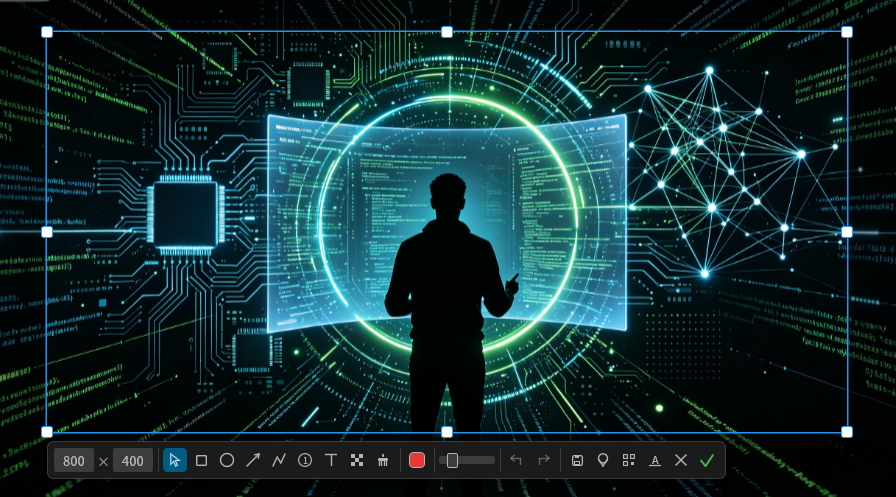

# LaterScreen

[](https://github.com/crazykun/LaterScreen/actions/workflows/ci.yml)
[](https://github.com/crazykun/LaterScreen/releases)
[](LICENSE)

跨平台截图标注工具，Rust 编写，命令名 `lscreen`，目标对齐 Snipaste 级体验：截图、标注、取色、二维码、OCR、GIF 录屏、贴图。

- **单文件 ≤ 20MB**：一个可执行文件装下全部功能，无动态库依赖，拷走即用
- **冷启动即用**：无需常驻也能瞬时唤起；常驻托盘时空闲内存 < 10MB
- **三平台**：Linux（x64 / arm64 / armv7 / x86）、Windows、macOS
- **GUI + CLI 双形态**：既有完整交互标注界面，每个功能也都能纯命令行调用，方便脚本与快捷键绑定



## 特性

### 交互截图（`lscreen gui`）

| 功能 | 说明 |
|---|---|
| 框选 | 拖拽框选 / 单击全屏，框选时带像素放大镜（网格取景 + 实时色值） |
| 选区调整 | 拖角点/边缘缩放（框外一圈也可命中）、框内拖拽移动、工具栏输入宽 × 高精确设定 |
| 标注工具 | 8 种：矩形、椭圆（Shift 正圆/正方形）、箭头、画笔（Shift 直线）、自增标号、文本（支持中文输入法）、马赛克、橡皮擦（恢复原图） |
| 元素编辑 | 已画元素可再编辑：悬停高亮、拖拽移动、控制点调整、双击改文本、Delete 删除 |
| 样式 | 8 预设色 + 完整取色器，线宽/字号联动滑杆，全量撤销/重做 |
| 导出 | 复制到剪贴板（Ctrl+C / Enter / 双击）、保存 PNG（Ctrl+S） |
| 贴图 | 选区钉在屏幕上置顶悬浮（Ctrl+P），独立进程可多个并存；拖拽移动、滚轮缩放（25%–400%，光标锚定）、双击复制 |
| 识别 | 选区内容直接识别二维码 / OCR 文字，结果一键复制 |

### 托盘常驻（`lscreen`）

不带参数运行即静默驻留后台：托盘菜单（截图 / 取色 / 贴图 / 录屏 / 滚动截图 / 历史 / 配置 / 退出）+ 全局热键随时唤起，默认 **F1 截图**。**「历史」打开一个缩略图面板浮窗**（Snipaste 同款思路：原生菜单画不了缩略图，自绘窗口展示最近截图/贴图/录屏，单击复制，录屏为打开目录并选中文件，右键可贴图/打开/删除）。每个动作是独立子进程，用完即退，主进程始终轻量。

### 命令行直达

所有功能均可无界面调用：

| 子命令 | 功能 |
|---|---|
| `shot` | 截屏到文件 / 剪贴板 |
| `record` | GIF 录屏（gifski 编码） |
| `qr` | 识别二维码（屏幕 / 图片） |
| `ocr` | 识别文字（屏幕 / 图片，自动选择引擎） |
| `pick` | 屏幕取色器 |
| `pin` | 贴图：把图片钉在屏幕上 |

## 安装

从 [Releases](https://github.com/crazykun/LaterScreen/releases) 下载对应平台的包：

| 平台 | 包 | 安装方式 |
|---|---|---|
| Debian / Ubuntu / Deepin | `lscreen_*.deb` | `sudo apt install ./lscreen_*.deb` |
| Fedora / RHEL / openSUSE | `lscreen-*.rpm` | `sudo rpm -i lscreen-*.rpm` |
| 任意 Linux 发行版 | `*.AppImage` | `chmod +x` 后直接运行 |
| 任意 Linux 发行版 | `*.tar.gz` | 解压后将 `lscreen` 放入 PATH |
| Windows | `*-setup.exe` | 自绘安装器：单用户安装免 UAC，含快捷方式与卸载器（Windows 10 及以上） |
| Windows（免安装） | `*.zip` | 解压即用（Windows 10 及以上） |
| macOS | `*.dmg` | 拖入 Applications；未签名，首次需右键 → 打开 |

macOS 未签名应用会被 Gatekeeper 拦截（「已损坏 / 无法打开」），除右键 → 打开外，
也可清除隔离属性一次性放行：

```bash
xattr -d com.apple.quarantine /Applications/LaterScreen.app
```

或从源码安装（需 Rust 工具链 + C/C++ 编译器，无开发库依赖）：

```bash
git clone https://github.com/crazykun/LaterScreen && cd LaterScreen
cargo install --path crates/app        # 装入 ~/.cargo/bin/lscreen
```

## 快速上手

日常使用只需记住两条：

```bash
lscreen        # 托盘常驻，之后按 F1 随时截图
lscreen gui    # 不想常驻？直接进入截图（框选 → 标注 → 复制/保存）
```

其余功能按需取用：

```bash
lscreen pick                           # 屏幕取色器（单击复制 HEX 并退出）
lscreen qr                             # 识别主屏上的二维码，输出到 stdout
lscreen qr -i photo.png                # 识别图片文件中的二维码
lscreen ocr --region 0,0,800,600       # 识别屏幕区域文字
lscreen ocr -i doc.png --lang chi_sim --lang eng          # 识别图片文字
lscreen record --select --fps 10       # 框选区域录制 GIF，Esc / 停止按钮结束
lscreen record --select --mp4          # 录制 MP4/H.264（Linux）
lscreen record --region 0,0,800,600 -o demo.gif           # 按区域直接录制
lscreen scroll                         # 滚动长截图：框选 → 自动滚动拼接 → 标注预览（Linux X11）
lscreen shot -o out.png                # 无界面截全屏
lscreen shot --region 100,100,800,600 --clipboard         # 截区域进剪贴板
lscreen pin -i img.png                 # 把图片钉在屏幕上
lscreen config                         # 打开配置面板（热键/保存目录/默认工具等）
lscreen tray --foreground              # 托盘前台运行（调试/自启动用）
```

> `--region X,Y,W,H` 均为**物理像素**坐标（截图/录屏的实际像素），HiDPI 缩放下与桌面显示的「逻辑分辨率」不同；多显示器时基于虚拟桌面原点。

### 子命令选项

完整以 `lscreen <子命令> --help` 为准：

| 子命令 | 选项 | 说明 |
|---|---|---|
| `shot` | `--region X,Y,W,H` | 截取区域，缺省整主屏 |
| | `-o, --output <路径>` | 输出 PNG 路径，缺省 `~/Pictures/lscreen_时间戳.png` |
| | `-c, --clipboard` | 同时复制到剪贴板 |
| `record` | `--region X,Y,W,H` | 录制区域，缺省整主屏 |
| | `--select` | 先交互框选区域，框完立即开始录制（Esc 取消） |
| | `--mp4` | 编码为 MP4/H.264（缺省 GIF；目前 Linux 可用） |
| | `--duration <秒>` | 最长录制时长，缺省 30 |
| | `--fps <1-30>` | 帧率，缺省 10 |
| | `--quality <值>` | GIF 编码质量 1-100（缺省 90）；`--mp4` 时为目标码率 kbps 200-50000（缺省 4000） |
| | `-o, --output <路径>` | 输出 `.gif`/`.mp4` 路径，缺省 `~/Pictures` |
| `scroll` | `--region X,Y,W,H` | 截取区域，缺省交互框选（Esc 取消）；仅 Linux X11 |
| | `--steps <1-1000>` | 最大滚动步数，缺省 60 |
| | `--clicks <1-9>` | 每步滚轮格数，缺省 2 |
| | `--pause-ms <50-2000>` | 每步等待内容稳定的毫秒数，缺省 200 |
| | `-o, --output <路径>` | 输出 PNG 路径；缺省打开标注预览窗口（保存/复制/贴图；Ctrl+滚轮或 Ctrl+=/− 缩放、Ctrl+0 适应宽度；中键拖动或「选择」工具左键拖空白平移） |
| `ocr` | `--region X,Y,W,H` | 识别区域，缺省整主屏 |
| | `-i, --input <图片>` | 从图片识别（PNG/JPEG），指定时忽略 `--region` |
| | `--lang <语言>` | 识别语言，可多次，如 `--lang chi_sim --lang eng` |
| `qr` | `--region X,Y,W,H` | 识别区域，缺省整主屏 |
| | `-i, --input <图片>` | 从图片识别，指定时忽略 `--region` |
| `pick` | — | 无选项；Ctrl+R/H/K 复制 RGB/HEX/CMYK |
| `pin` | `-i, --input <图片>` | 贴图的图片文件；缺省从 stdin 读 PNG（覆盖层内部通道） |
| | `--pos X,Y` | 窗口初始位置（逻辑点），支持负坐标 |
| | `--scale <比例>` | 屏幕缩放比（物理像素/逻辑点），缺省 1.0 |
| `tray` | `--foreground` | 前台运行（缺省分离到后台，终端立即返回） |
| `config` | — | 打开配置面板 |
| `history` | — | 打开截图历史面板（最近截图/贴图/录屏，缩略图网格，单击复制/定位） |
| `gui` | — | 交互式截图，与托盘模式的「截图」动作相同 |

录屏期间会弹出置顶状态窗口（已录时长/帧数 + 停止按钮），按 Esc 或点「停止录制」结束；终端内直接运行也可 Ctrl+C 停止。

### 交互模式快捷键

| 键 | 功能 |
|---|---|
| 拖拽 / 单击 | 框选区域 / 全屏 |
| Ctrl+C / Enter / 双击 | 复制到剪贴板并退出 |
| Ctrl+S | 保存 PNG 并退出 |
| Ctrl+P | 把选区钉为贴图 |
| Ctrl+Z / Ctrl+Y（或 Ctrl+Shift+Z） | 撤销 / 重做 |
| Ctrl+R / Ctrl+H / Ctrl+K | 复制指针处颜色 RGB / HEX / CMYK |
| Delete / Backspace | 删除选中元素 |
| Esc | 关闭弹窗 / 取消选中 / 退出 |

### 全局热键

默认 **F1 截图**（Snipaste 惯例），可在配置面板改为其他组合。截图 / 取色 / 贴图 / 录屏 / 滚动截图五个动作都可各自绑定热键，除截图外默认留空（不注册）。注意 `Ctrl+Alt+A` 在 Deepin 等桌面已被系统截图占用。

托盘实现：Linux 走 ksni（纯 Rust 的 StatusNotifierItem/D-Bus 直连，无动态库依赖）；Windows/macOS 走 tray-icon（系统原生 API）。全局热键在 Wayland 会话（无 X11）不可用，托盘与菜单不受影响。窗口在 Linux 下显式设置 `WM_CLASS=lscreen` 并配 `StartupWMClass`，任务栏图标正确归属到 lscreen。

### 配置

零配置完全可用：无配置文件时全部取默认值，且不会主动生成文件。需要调整时运行 `lscreen config`，保存后运行中的托盘 1 秒内自动热加载。

| 平台 | 配置文件路径 |
|---|---|
| Linux | `~/.config/lscreen/config.toml` |
| Windows | `%APPDATA%\lscreen\config.toml` |
| macOS | `~/Library/Application Support/lscreen/config.toml` |

可配置项：保存目录、文件名模板（默认 `lscreen_{YYYYMMDD}_{HHMMSS}`）、默认工具/颜色/线宽、复制后是否自动退出、保存后是否打开目录、历史保留条数（默认 10，1–50）、五个全局热键（截图 / 取色 / 贴图 / 录屏 / 滚动截图）。

## 运行环境

| 平台 | 说明 |
|---|---|
| Linux | 交互模式需 X11 桌面（`DISPLAY`），Wayland 会话暂不支持（规划中）；截屏为纯 Rust X11 协议实现，运行时无需任何额外库 |
| Windows | **Windows 10 及以上**（OCR 走 WinRT `Windows.Media.Ocr`，且 Rust 工具链已不支持 Win7——Win7 上会报缺少 combase.dll）；走系统 API（xcap），无外部依赖 |
| macOS | 走系统 API（xcap），无外部依赖 |

`ocr` 按平台自动选择引擎，无需配置：

| 平台 | 引擎 | 说明 |
|---|---|---|
| Windows | 系统 `Windows.Media.Ocr` | 支持中文，零依赖 |
| macOS | 系统 Vision | 支持中文，零依赖 |
| Linux | 系统 tesseract（优先） | 支持中文：`sudo apt install tesseract-ocr tesseract-ocr-chi-sim` |
| 全平台兜底 | 内置纯 Rust ocrs | 零依赖，仅拉丁字母；首次使用自动下载约 4MB 模型到 `~/.cache/ocrs` |

Linux 上复制到剪贴板后，由分离的守护子进程持有内容，被其他程序覆盖后自动退出——不需要主程序常驻。

## 从源码构建

```bash
cargo build --release        # 产物 target/release/lscreen
cargo run --release          # 构建并直接进入交互截图
cargo test --workspace       # 单元测试（无需显示器）

./target/release/lscreen --help        # 查看全部子命令
```

Linux 构建需 Rust 工具链 + C/C++ 编译器（MP4 用的 openh264 从 C++ 源静态编译，
`build-essential` 即可），无需任何开发库头文件。开发约定见 [AGENTS.md](AGENTS.md)。

## 打包发布

一键打包脚本 `scripts/package.sh`，产物统一进 `dist/`（含 SHA256SUMS）：

| 平台 | 架构 | 产物 |
|---|---|---|
| Linux | x64 / arm64 / armv7 / x86 | tar.gz + deb + rpm + AppImage |
| Windows | x64 | zip + 自绘安装器 exe（egui 单屏向导，per-user 安装，内嵌主程序，`crates/setup`，无需 NSIS） |
| macOS | arm64 / x64 | tar.gz + dmg（仅 CI 出包） |

```bash
scripts/package.sh              # 打包本机具备工具链的全部默认目标
scripts/package.sh --list       # 查看默认目标集与本机可用性
scripts/package.sh aarch64-unknown-linux-gnu   # 指定目标

# Linux 交叉目标装对应交叉 gcc + g++（MP4 编码的 openh264 是 C++ 源）：
sudo apt install gcc-aarch64-linux-gnu g++-aarch64-linux-gnu \
                 gcc-arm-linux-gnueabihf g++-arm-linux-gnueabihf \
                 gcc-i686-linux-gnu g++-i686-linux-gnu \
                 gcc-mingw-w64-x86-64 g++-mingw-w64-x86-64
# 原生包格式的工具（缺哪个就跳过哪种格式，不影响 tar.gz/zip）：
sudo apt install rpm             # rpm 包（Windows 安装器由 cargo 自行构建）
# AppImage: github.com/AppImage/appimagetool 下载放入 PATH
```

全平台出包（含 macOS、Windows MSVC）走 GitHub Actions：

```bash
git tag v0.4.0 && git push --tags   # 自动构建全平台包并发布 GitHub Release
```

## 路线图

- [x] 截图标注（9 工具 + 元素编辑 + 撤销/重做）
- [x] 取色器、二维码识别
- [x] OCR（Windows 系统 OCR / macOS Vision / Linux tesseract，内置 ocrs 兜底）
- [x] GIF 录屏
- [x] MP4 录屏（Linux openh264 静态链接；Win/mac 系统编码器待实现）
- [x] 滚动长截图（Linux X11：自动滚动 + 帧间拼接 + 标注预览）
- [x] 贴图（Pin to screen）
- [x] CLI 无界面模式
- [x] 托盘常驻 + 全局热键 + 配置面板
- [x] 全平台打包发布（deb / rpm / AppImage / Windows 安装器 / dmg）
- [x] Wayland 整屏截图（xdg-desktop-portal；区域采帧/录屏仍 X11）
- [ ] 录制期间常显选区边框（边框画在选区外侧，不进成品）
- [x] 识别结果面板可拖动、可缩放（挡住原文时挪开对照，长文本可拉高）
- [ ] 混合 DPI 多显示器

详见 [docs/PLAN.md](docs/PLAN.md)。

## 架构

```
crates/
  core/      图元模型、撤销栈、命中检测、tiny-skia 导出渲染、取色、二维码（无 UI 依赖）
  capture/   截屏平台层（Linux: x11rb 纯 Rust；Win/mac: xcap 系统 API）
  app/       可执行文件：clap CLI + egui 覆盖层
  ocr/       OCR trait + 引擎实现（tesseract 子进程 / 内置 ocrs）
  record/    GIF 录屏编码（gifski）
```

交互期用 egui Painter 实时绘制，导出用 tiny-skia 软渲染合成，两条路径共享同一份图元数据。设计细节与里程碑见 [docs/PLAN.md](docs/PLAN.md)。

## License

[MIT](LICENSE)
