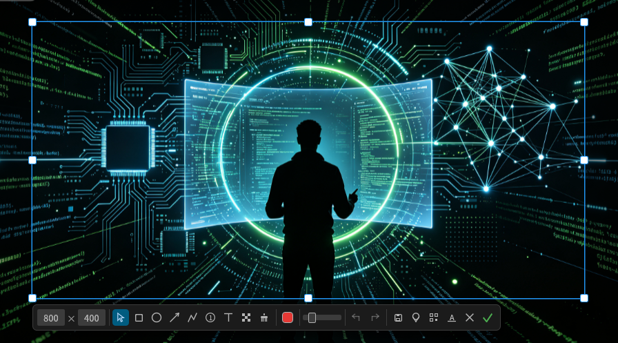
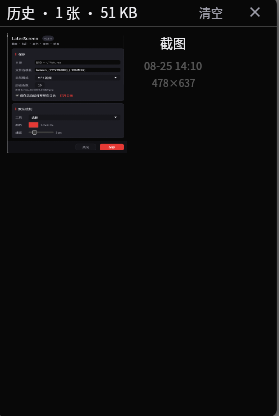
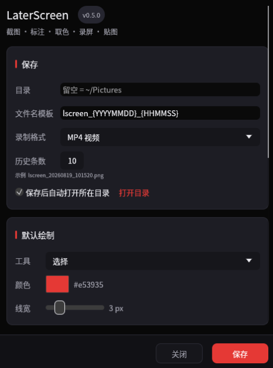

# LaterScreen

<div align="center">

[](https://github.com/crazykun/LaterScreen/actions/workflows/ci.yml)
[](https://github.com/crazykun/LaterScreen/releases)
[](LICENSE)

**跨平台截图标注工具 · Rust 编写 · 单文件 ≤ 20MB · 无动态库依赖**

截图 · 标注 · 取色 · 二维码 · OCR · GIF/MP4 录屏 · 贴图 · 滚动截图

</div>



<details>
<summary><b>更多界面截图</b>（历史面板 / 配置面板）</summary>

<div align="center">

| 历史面板 | 配置面板 |
|---|---|
|  |  |

</div>

</details>

## ✨ 为什么选它

| 亮点 | 说明 |
|---|---|
| **一个文件，拷走即用** | 静态链接，当前约 14MB，不依赖任何系统库 |
| **三平台同体验** | Linux（x64 / arm64 / armv7 / x86）、Windows 10+、macOS |
| **GUI + CLI 双形态** | 有完整标注界面，每个功能也能纯命令行调用，可写进脚本 |
| **不后台联网** | 只有你点「检查更新」时才发一次 HTTPS 请求（纯 Rust TLS） |

## 🚀 快速上手

```bash
lscreen        # 托盘常驻（默认行为），之后按 F1 随时截图
lscreen gui    # 不常驻，直接框选 → 标注 → 复制/保存
```

## 🧰 功能一览

| 功能 | 说明 | 快捷键 |
|---|---|---|
| **截图标注** | 8 种工具：矩形 / 椭圆 / 箭头 / 画笔 / 自增标号 / 文本 / 马赛克 / 橡皮擦 | 拖动即画 |
| **元素再编辑** | 已画元素可拖拽、拉控制点，双击改文本 | — |
| **撤销重做** | 全量快照，图片本体不进栈 | `Ctrl+Z` / `Ctrl+Y` |
| **输出** | 复制到剪贴板 / 存 PNG | `Ctrl+C` / `Ctrl+S` |
| **贴图** | Snipaste 式置顶悬浮，可多窗口并存 | `Ctrl+P` |
| **取色器** | 放大镜 + 取色历史（最近 8 色） | `Ctrl+R`/`H`/`K` 复制 RGB/HEX/CMYK |
| **二维码** | 识别屏幕上的码；工具栏也可生成并插入标注层 | — |
| **OCR** | 框选或 `-i` 读图，结果到 stdout | — |
| **录屏** | GIF / MP4(H.264)，可选麦克风与系统声 | `Ctrl+C` 停止 |
| **滚动截图** | 框选后自动滚动拼接长图（Wayland 除外） | — |
| **上传** | 交给自配命令，返回 URL 自动复制 | — |
| **历史面板** | 缩略图浮窗，管理最近的截图 / 贴图 / 录屏 | — |

<details>
<summary><b>标注细节</b>（文本背景色、二维码插入、取色历史）</summary>

- **文本可开背景色**：当前色圆角底 + 自动黑/白对比字色，解决浅色截图上白字读不清的问题。
- **工具栏可生成二维码**：输入文本插入标注层，随截图一起导出，可拖动、四角等比缩放。
- **取色历史**：放大镜旁保留最近 8 个色块，点击选用，再按 `Ctrl+R/H/K` 以其它格式复制。

</details>

<details>
<summary><b>贴图细节</b>（置顶悬浮窗口的操作）</summary>

多窗口并存，互不干扰：

| 操作 | 方式 |
|---|---|
| 缩放 | 滚轮，或键盘 `+` / `-` / `0`（工具条百分比重置 100%） |
| 不透明度 | `Shift+滚轮`，范围 20–100% |
| 旋转 / 翻转 | `R` 旋转 90°、`H` 水平翻转、`V` 垂直翻转 |
| 像素网格 | 放大到 8x 以上自动叠加，仅作参照，不进复制/保存的位图 |
| 点击穿透 | 点击穿到下层窗口，`Esc` 或托盘菜单「贴图 → 关闭穿透」恢复 |

</details>

<details>
<summary><b>托盘与历史面板</b></summary>

托盘菜单含**截图 / 取色 / 贴图 ▸ / 录屏 / 滚动截图 / 延时截图 / 历史 / 配置**。
除「配置」外七个动作都能各绑全局热键，**默认只有 F1 截图**，其余留空避免和桌面环境抢键。

「历史」是缩略图浮窗：

- 点击缩略图复制，录屏条目用默认播放器播放
- 右键可贴图 / 打开所在目录 / 删除
- 顶栏显示条数与占用体积，可一键清空
- 同一时刻只开一个面板；面板在后台时再按热键会把它唤回前台

</details>

## 💻 命令行

每个 GUI 功能都有无界面对等物，完整选项见 `lscreen <子命令> --help`：

```bash
lscreen shot   -o out.png                        # 无界面截图（--region X,Y,W,H 定点）
lscreen gui    --delay 3                         # 延时 3 秒截图（shot 同支持）
lscreen record --select --fps 10                 # 框选录 GIF（--mp4 出 MP4/H.264）
lscreen record --mp4 --audio system              # MP4 + 音轨：mic/system/both/off
lscreen scroll                                   # 滚动长截图
lscreen ocr    --region 0,0,800,600              # OCR（-i 指定图片，--lang 选语言）
lscreen qr     -i photo.png                      # 识别二维码
lscreen qr-gen "https://example.com" -o qr.png   # 生成二维码（--ecc L/M/Q/H）
lscreen pick                                     # 屏幕取色器
lscreen pin    -i img.png                        # 把图片钉到屏幕上
lscreen upload img.png                           # 上传并把 URL 复制到剪贴板
lscreen history                                  # 历史面板
lscreen config                                   # 配置面板
```

> `--region X,Y,W,H` 是**物理像素**坐标，多显示器时基于虚拟桌面原点。
>
> `upload` 需先在配置里启用上传命令，未配置时界面上不显示上传按钮。

## 📦 安装

**macOS 推荐 Homebrew：**

```bash
brew install --cask crazykun/ailater/lscreen
```

其余从 [Releases](https://github.com/crazykun/LaterScreen/releases) 取：

| 平台 | 格式 | 安装方式 |
|---|---|---|
| Debian / Ubuntu / Deepin | `.deb` | `sudo apt install ./lscreen_*.deb` |
| Fedora / RHEL / openSUSE | `.rpm` | `sudo rpm -i lscreen-*.rpm` |
| 任意 Linux | `.AppImage` / `.tar.gz` | 下载即用，免安装 |
| Windows 10+ | `-setup.exe` / `.zip` | 安装器 per-user 免 UAC，zip 解压即用（不支持 Win7/8） |
| macOS | `.dmg` | 拖入 Applications（未签名，首次右键 → 打开） |

<details>
<summary><b>从源码构建</b></summary>

需要 Rust 工具链 + C/C++ 编译器，**无需任何开发库**：

```bash
git clone https://github.com/crazykun/LaterScreen && cd LaterScreen
cargo install --path crates/app
```

开发中：

```bash
cargo build --release                 # 产物 target/release/lscreen
cargo run --release --bin=lscreen     # 构建并运行（裸命令 = 托盘驻留）
cargo test --workspace                # 单元测试，无需显示器
```

</details>

## ⚙️ 配置

零配置可用，**不生成文件**。改配置用 `lscreen config` 打开面板，保存后运行中的托盘 1 秒内自动热加载。

面板可调：保存目录、文件名模板、窗口主题（自动 / 浅色 / 夜间）、默认工具与颜色、初始选区（最前窗口 / 上次选区 / 全屏 / 无）、录制格式与音频、录制点击高亮、历史条数，以及七个全局热键。

> 「上次选区」在显示器布局变化后会自动作废回退。自动主题由 egui 跟随操作系统配色。
> 面板底部「检查更新」是**手动**的：查询 GitHub 上有没有新版本，有则在顶部提示并可直达下载页。

配置文件位置：

| 系统 | 配置文件 | 历史缓存 |
|---|---|---|
| Linux | `~/.config/lscreen/config.toml` | `~/.cache/lscreen/history/` |
| Windows | `%APPDATA%\lscreen\config.toml` | `%LOCALAPPDATA%\lscreen\history\` |
| macOS | `~/Library/Application Support/lscreen/config.toml` | `~/Library/Caches/lscreen/history/` |

历史副本刻意放**缓存目录**而非配置目录：它是可随时删掉的派生数据，直接删整个目录即可，不影响配置。

### 上传 hook（可选）

不内置任何图床 SDK，配好 `[upload]` 后把产物交给任意外部命令（uPic / PicGo / sup / 自写脚本都行）：

```toml
[upload]
command = ["/usr/local/bin/uploader", "--token", "xxx"]
```

约定只有三条：**产物路径经 stdin 传入**（不经 shell、不进 argv，无注入面）、**stdout 第一个非空行视为 URL**（自动复制并记入历史）、**非零退出把 stderr 提示给用户**。命令挂死 30 秒自动终止。

## 🖥️ 运行环境

| 平台 | 说明 |
|---|---|
| **Linux** | 交互模式需 X11 桌面；Wayland 下仅整屏截图可用（区域采帧 / 录屏仍需 X11），全局热键在 Wayland 不可用。OCR 优先系统 tesseract（中文需 `tesseract-ocr-chi-sim`），并以内置纯 Rust ocrs 兜底（仅拉丁字母，首次自动下载模型）。录屏音频（仅 MP4）运行时调系统工具：需 `ffmpeg` 与 `arecord` 或 `parec` 之一，缺失时**录制开始前**就报错，不会录完才发现没声音 |
| **Windows 10+** | 走系统 API，无外部依赖。OCR 用 WinRT 系统引擎，支持中文。录屏音频走 WASAPI 采集 + Media Foundation AAC，麦克风 / 系统声 / 混合均可 |
| **macOS** | 走系统 API，无外部依赖。OCR 用 Vision，支持中文。录屏音频走 CoreAudio（麦克风）+ ScreenCaptureKit（系统声，需 macOS 13+ 与「屏幕录制」权限）+ AudioToolbox AAC；因引入 ScreenCaptureKit，产物最低系统要求 macOS 12.3 |

## 🚢 打包发布

一键打包脚本 `scripts/package.sh`，产物统一进 `dist/`（含 SHA256SUMS）：

```bash
./scripts/package.sh                            # 打包本机具备工具链的全部默认目标
./scripts/package.sh --list                     # 查看默认目标集与本机可用性
./scripts/package.sh x86_64-unknown-linux-gnu   # 指定目标
```

交叉编译需装对应 gcc / g++（openh264 是 C++ 源）；rpm 需 `apt install rpm`；AppImage 需 [appimagetool](https://github.com/AppImage/appimagetool)。全平台出包（含 macOS、Windows MSVC）走 GitHub Actions：`git tag v0.11.3 && git push --tags`。

## 🏗️ 架构

```
crates/
  core/      图元模型、撤销栈、命中检测、tiny-skia 导出渲染、取色、二维码（无 UI 依赖）
  capture/   截屏平台层（Linux: x11rb 纯 Rust；Win/mac: xcap 系统 API）
  app/       可执行文件：clap CLI + egui 覆盖层 + 托盘
  ocr/       OCR 引擎（系统引擎 + 内置 ocrs 兜底）
  record/    录屏编码（gifski / openh264；音频：Linux=arecord/parec+ffmpeg 子进程链，
             Win=WASAPI+Media Foundation，mac=CoreAudio+AudioToolbox，系统 API 直采）
  setup/     Windows 自绘安装器
```

交互期用 egui 实时绘制，导出用 tiny-skia 软渲染，两条路径共享同一份图元数据。设计细节与里程碑见 [docs/PLAN.md](docs/PLAN.md)。

## 📄 License

[MIT](LICENSE)
