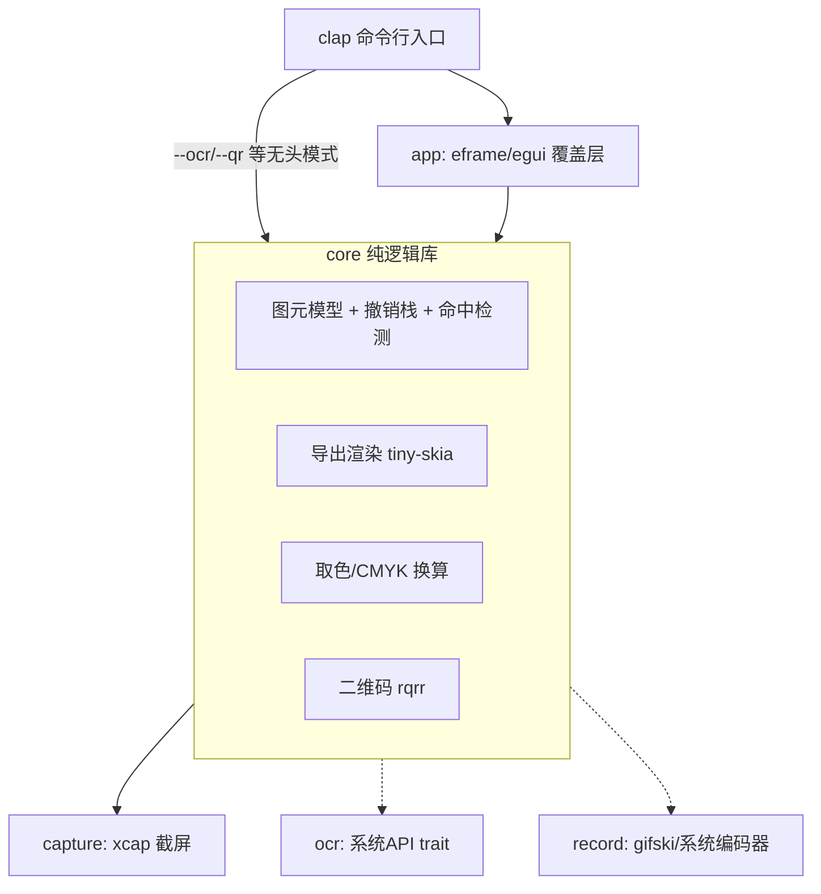

# LaterScreen 项目计划

跨平台截图工具（Windows / macOS / Linux），Rust 实现。目标对齐 Snipaste 级别的体验：
截图、标注、取色、二维码、OCR、录屏（GIF/MP4）、滚动长截图；单文件、体积小、启动快、用完即走。

## 1. 非功能性目标（硬约束）

| 约束 | 目标 | 实现手段 |
|---|---|---|
| 体积 | 最终产物 ≤ 10MB | `opt-level="z"` + fat LTO + strip + `panic="abort"`；避免重型依赖 |
| 单文件 | 无需安装、不依赖动态库（OCR 除外） | 静态链接；OCR/编码优先走**系统自带 API**（零捆绑） |
| 启动 | 冷启动 < 300ms 出选区 | 无运行时、按需初始化、截屏与窗口创建并行 |
| 内存 | 常态 < 100MB（全屏图 + 双缓冲） | 单份截图内存 + 图元矢量数据，不做多余拷贝 |
| 用完即走 | 进程不驻留 | 无托盘常驻；全局快捷键交给系统绑定命令行（见 §5） |

## 2. 架构

核心原则：**core 不依赖任何 UI**；CLI 与 GUI 是 core 之上的两个薄壳；
平台差异全部收敛在 platform 抽象层。



### Crate 划分

```
crates/
  core/      lscreen-core     图元模型、撤销栈、命中检测、导出渲染、取色、二维码
  capture/   lscreen-capture  截屏（xcap 封装，屏蔽 X11/Wayland/多显示器差异）
  app/       lscreen          可执行文件：clap CLI + egui 覆盖层
后续新增：
  ocr/       lscreen-ocr      trait + 三平台实现（M3）
  record/    lscreen-record   录屏编码（M4）
```

### 关键设计决策

1. **双渲染路径**：交互期用 `egui::Painter` 实时绘制（GPU/glow），导出时用
   `tiny-skia` 在 core 内软渲染合成到截图上。两者共享同一份图元数据与几何参数
   （箭头头长、马赛克格子等来自 `Element` 方法）。一致性承诺：**几何一致、
   视觉近似**——文本因 epaint 与 ab_glyph 的光栅化差异（hinting/AA/字距）
   无法做到像素一致，马赛克通过共用 `mosaic_cells` 做到像素一致。
   代价是每种图元两份绘制代码，新增图元时两边都要写。
2. **撤销/重做用快照而非命令模式**：图元是小矢量数据（每个几十字节），
   全量快照 `Vec<Vec<Element>>` 实现简单且绝不出错。图片本体不进快照。
3. **马赛克 = 网格色块**：按笔迹覆盖的网格单元，从原图计算均值色，
   交互层画色块矩形、导出层同样画色块，两边像素级一致。
4. **橡皮擦 = 原图回贴**：按绘制顺序渲染，橡皮擦笔迹用原图对应区域贴回，
   天然擦掉此前的所有标注。
5. **系统 API 优先**：OCR（Win `Windows.Media.Ocr` / mac Vision）、
   MP4 编码（Win Media Foundation / mac VideoToolbox）都走系统自带能力，
   零体积零依赖；仅 Linux 需要兜底方案。

## 3. 技术选型

| 功能 | 选型 | 备选/说明 |
|---|---|---|
| UI | egui (eframe 0.35) | 即时模式适合画布高频重绘；备选 winit+tiny-skia 纯软渲染（体积极限方案） |
| 截屏 Linux | **自研：x11rb（X11，纯 Rust）** | Wayland 走 ashpd portal（M5，纯 Rust D-Bus）。弃用 xcap Linux 路径：它强制链接 pipewire C 库，违反"无动态库依赖"目标 |
| 截屏 Win/mac | xcap | 这两个平台走系统 API，无 C 编译依赖 |
| 交互渲染 | egui Painter | — |
| 导出渲染 | tiny-skia | 纯 Rust 2D 软渲染 |
| 文本光栅化 | ab_glyph | 字体运行时从系统加载（fc-match / 平台字体目录），不捆绑 |
| 图像编解码 | image | PNG/JPEG 导出 |
| 剪贴板 | arboard | 支持图像写剪贴板，三平台 |
| CLI | clap (derive) | 子命令直达功能 |
| 二维码 | rqrr | 纯 Rust |
| GIF 编码 | gifski | 纯 Rust，质量最好 |
| MP4 编码 | 系统编码器 | Win MF / mac VideoToolbox / Linux openh264 静态链接 |
| OCR | 系统 API | Win `Windows.Media.Ocr` / mac Vision / Linux 外挂 tesseract（约束豁免项） |

## 4. 里程碑

### M1 截图 + 标注（核心价值，先做）
- [ ] workspace 骨架 + 体积优化 profile
- [ ] core：图元模型（矩形/椭圆/箭头/直线/曲线/标号/文本/马赛克/橡皮擦）、
      样式（颜色/线宽/字号）、命中检测、撤销/重做
- [ ] capture：多显示器截屏
- [ ] app：全屏覆盖层、区域框选（可调整边缘）、工具栏、绘制交互、
      Shift 约束（正圆/正方形/水平垂直直线）、悬停选中/拖拽移动/删除
- [ ] 快捷键：Ctrl+Z 撤销、Ctrl+Y 重做、Ctrl+S 存文件、Ctrl+C/双击 进剪贴板、Esc 退出
- [ ] 导出：tiny-skia 合成 → PNG 文件 / 剪贴板

### M2 取色器 + 二维码 + CLI
- [ ] 取景框放大镜（像素级十字线 + 周边像素放大）
- [ ] Ctrl+R 复制 RGB / Ctrl+H 复制 HEX / Ctrl+K 复制 CMYK
- [ ] 框选区域内二维码识别（rqrr）
- [ ] CLI：`lscreen`（交互截图）、`lscreen shot --region x,y,w,h -o f.png`、
      `lscreen pick`（取色）、`lscreen qr`、`lscreen ocr`（M3 后可用）

### M3 OCR
- [ ] `TextRecognizer` trait；Windows（windows-rs）、macOS（objc2 + Vision）实现
- [ ] Linux：探测系统 tesseract 可执行文件调用（文档明确此为唯一外部依赖）
- [ ] 识别结果浮层展示 + 一键复制

### M4 录屏 + 滚动截图（技术风险最高，放最后）
- [ ] 选区连续采帧（xcap）→ gifski 编码 GIF
- [ ] MP4：三平台系统编码器抽象
- [ ] 滚动截图：模拟滚轮 + 帧间特征匹配拼接（先支持等速滚动的简单场景）

### M5 打磨
- [ ] Wayland portal 路径验证（GNOME/KDE/wlroots）
- [ ] 多显示器混合 DPI
- [ ] CI：三平台构建产物 + 体积回归检查

## 5. 已知风险与对策

| 风险 | 影响 | 对策 |
|---|---|---|
| Wayland 禁止直接抓屏 | Linux 部分桌面不可用 | 走 portal（M5）；X11 优先支持；边缘 compositor 明确声明不支持 |
| "用完即走"与全局快捷键矛盾 | 无法自监听热键 | 快捷键绑定交给系统/桌面环境，绑定到 `lscreen` 命令；编辑期快捷键由 egui 处理 |
| X11 剪贴板随进程退出丢失 | 复制不可靠 | ✅ 已解决：分离守护子进程（arboard wait()）持有剪贴板，被覆盖后自动退出 |
| 混合 DPI 多显示器 | 覆盖层/坐标错位 | 单屏已自洽（View 比例映射）；多屏混合 DPI 在 M5 与 capture_all 一并处理 |
| 纯 Rust 无 H.264 编码器 | MP4 依赖问题 | 系统编码器；GIF 先行（✅ 已完成） |
| 滚动截图拼接不稳 | 长图错位 | 特征行匹配 + 重叠区校验；M4 再攻坚 |
| egui 版本 API 变动快 | 升级成本 | 锁定 minor 版本，UI 层薄、核心不受影响 |

## 6. 目录规范

```
doc/          设计与计划文档
crates/       所有库与可执行 crate
  core/src/   model.rs(图元) history.rs(撤销) render.rs(导出) color.rs qr.rs
  capture/    lib.rs
  app/src/    main.rs(CLI入口) ui/(覆盖层、工具栏、画布交互)
```
