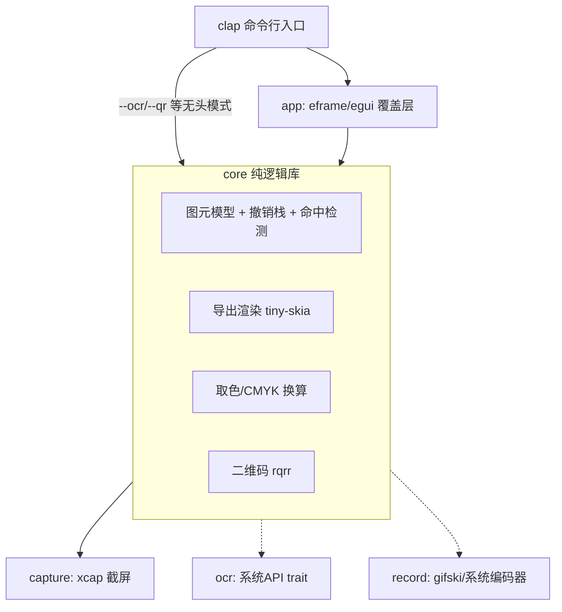

# LaterScreen 项目计划

跨平台截图工具（Windows / macOS / Linux），Rust 实现。目标对齐 Snipaste 级别的体验：
截图、标注、取色、二维码、OCR、录屏（GIF/MP4）、滚动长截图；单文件、体积小、启动快、小而美常驻。

## 1. 非功能性目标（硬约束）

| 约束 | 目标 | 实现手段 |
|---|---|---|
| 体积 | 最终产物 ≤ 10MB | `opt-level="z"` + fat LTO + strip + `panic="abort"`；避免重型依赖 |
| 单文件 | 无需安装、不依赖动态库（OCR 除外） | 静态链接；OCR/编码优先走**系统自带 API**（零捆绑） |
| 启动 | 冷启动 < 300ms 出选区 | 无运行时、按需初始化、截屏与窗口创建并行 |
| 内存 | 常态 < 100MB（全屏图 + 双缓冲） | 单份截图内存 + 图元矢量数据，不做多余拷贝 |
| 小而美常驻 | 托盘常驻进程空闲 < 30MB | 常驻体只持有托盘图标 + 配置 + 热键监听，**不预载截图缓冲**；截图/贴图/录屏各自独立窗口，用完释放。CLI 单次调用仍是即起即退 |

## 2. 架构

核心原则：**core 不依赖任何 UI**；CLI 与 GUI 是 core 之上的两个薄壳；
平台差异全部收敛在 platform 抽象层。



### Crate 划分

```
crates/
  core/      lscreen-core     图元模型、撤销栈、命中检测、导出渲染、取色、二维码
  capture/   lscreen-capture  截屏（xcap 封装，屏蔽 X11/Wayland/多显示器差异）
  app/       lscreen          可执行文件：clap CLI + egui 覆盖层
后续新增：
  ocr/       lscreen-ocr      trait + 三平台实现（M3）
  record/    lscreen-record   录屏编码（M4）
```

### 关键设计决策

1. **双渲染路径**：交互期用 `egui::Painter` 实时绘制（GPU/glow），导出时用
   `tiny-skia` 在 core 内软渲染合成到截图上。两者共享同一份图元数据与几何参数
   （箭头头长、马赛克格子等来自 `Element` 方法）。一致性承诺：**几何一致、
   视觉近似**——文本因 epaint 与 ab_glyph 的光栅化差异（hinting/AA/字距）
   无法做到像素一致，马赛克通过共用 `mosaic_cells` 做到像素一致。
   代价是每种图元两份绘制代码，新增图元时两边都要写。
2. **撤销/重做用快照而非命令模式**：图元是小矢量数据（每个几十字节），
   全量快照 `Vec<Vec<Element>>` 实现简单且绝不出错。图片本体不进快照。
3. **马赛克 = 网格色块**：按笔迹覆盖的网格单元，从原图计算均值色，
   交互层画色块矩形、导出层同样画色块，两边像素级一致。
4. **橡皮擦 = 原图回贴**：按绘制顺序渲染，橡皮擦笔迹用原图对应区域贴回，
   天然擦掉此前的所有标注。
5. **系统 API 优先**：OCR（Win `Windows.Media.Ocr` / mac Vision）、
   MP4 编码（Win Media Foundation / mac VideoToolbox）都走系统自带能力，
   零体积零依赖；仅 Linux 需要兜底方案。

## 3. 技术选型

| 功能 | 选型 | 备选/说明 |
|---|---|---|
| UI | egui (eframe 0.35) | 即时模式适合画布高频重绘；备选 winit+tiny-skia 纯软渲染（体积极限方案） |
| 截屏 Linux | **自研：x11rb（X11，纯 Rust）** | Wayland 走 ashpd portal（M5，纯 Rust D-Bus）。弃用 xcap Linux 路径：它强制链接 pipewire C 库，违反"无动态库依赖"目标 |
| 截屏 Win/mac | xcap | 这两个平台走系统 API，无 C 编译依赖 |
| 交互渲染 | egui Painter | — |
| 导出渲染 | tiny-skia | 纯 Rust 2D 软渲染 |
| 文本光栅化 | ab_glyph | 字体运行时从系统加载（fc-match / 平台字体目录），不捆绑 |
| 图像编解码 | image | PNG/JPEG 导出 |
| 剪贴板 | arboard | 支持图像写剪贴板，三平台 |
| CLI | clap (derive) | 子命令直达功能 |
| 二维码 | rqrr | 纯 Rust |
| GIF 编码 | gifski | 纯 Rust，质量最好 |
| MP4 编码 | 系统编码器 | Win MF / mac VideoToolbox / Linux openh264 静态链接 |
| OCR | 系统 API | Win `Windows.Media.Ocr` / mac Vision / Linux 外挂 tesseract（约束豁免项） |

## 4. 里程碑

### M1 截图 + 标注（核心价值，先做）
- [ ] workspace 骨架 + 体积优化 profile
- [ ] core：图元模型（矩形/椭圆/箭头/直线/曲线/标号/文本/马赛克/橡皮擦）、
      样式（颜色/线宽/字号）、命中检测、撤销/重做
- [ ] capture：多显示器截屏
- [ ] app：全屏覆盖层、区域框选（可调整边缘）、工具栏、绘制交互、
      Shift 约束（正圆/正方形/水平垂直直线）、悬停选中/拖拽移动/删除
- [ ] 快捷键：Ctrl+Z 撤销、Ctrl+Y 重做、Ctrl+S 存文件、Ctrl+C/双击 进剪贴板、Esc 退出
- [ ] 导出：tiny-skia 合成 → PNG 文件 / 剪贴板

### M2 取色器 + 二维码 + CLI
- [ ] 取景框放大镜（像素级十字线 + 周边像素放大）
- [ ] Ctrl+R 复制 RGB / Ctrl+H 复制 HEX / Ctrl+K 复制 CMYK
- [ ] 框选区域内二维码识别（rqrr）
- [ ] CLI：`lscreen`（交互截图）、`lscreen shot --region x,y,w,h -o f.png`、
      `lscreen pick`（取色）、`lscreen qr`、`lscreen ocr`（M3 后可用）

### M3 OCR
- [ ] `TextRecognizer` trait；Windows（windows-rs）、macOS（objc2 + Vision）实现
- [ ] Linux：探测系统 tesseract 可执行文件调用（文档明确此为唯一外部依赖）
- [ ] 识别结果浮层展示 + 一键复制

### M4 录屏 + 滚动截图（技术风险最高，放最后）
- [ ] 选区连续采帧（xcap）→ gifski 编码 GIF
- [ ] MP4：三平台系统编码器抽象
- [ ] 滚动截图：模拟滚轮 + 帧间特征匹配拼接（先支持等速滚动的简单场景）

### M5 打磨
- [ ] Wayland portal 路径验证（GNOME/KDE/wlroots）
- [ ] 多显示器混合 DPI
- [ ] 多屏窗口定位真机验证：`with_position + with_fullscreen` 在部分 WM 上
      fullscreen 可能忽略 position hint 落错屏（CI 测不了，需双屏手动确认）
      ——✅ Deepin 25 (KWin/X11) 双屏实测通过（2026-08-17）：覆盖层正确落在
      鼠标所在屏；其他 WM（GNOME/i3 等）待社区反馈
- [ ] CI：三平台构建产物 + 体积回归检查（✅ 已搭，见 .github/workflows/ci.yml）；
      远期注意 ldd 白名单对全静态产物会误报

### M6 界面打磨：图标化工具栏（✅ 2026-08-18）

原状：15 个中文文字按钮横向占用超过 620pt，小屏或窄选区下挤压严重。

- [x] 工具栏按钮改为图标 + hover tooltip（含快捷键提示）
- [x] 图标方案调整：**全部 Painter 手绘 12px 矢量线稿**（比 Unicode 符号更稳——
      不赌 emoji 字体覆盖，任何系统渲染一致；仅标号「1」与 OCR「A」用拉丁字形）。
      不引入 SVG 库、不打包 PNG 图集
- [x] 按钮统一 24×24，间距 2pt，整条工具栏约 470pt（原 620+）
- [x] 颜色选择器改为单个当前色按钮 + 点击展开调色板 popup（egui 0.35 `Popup::menu`）
- [x] 每个图标按钮有 `on_hover_text` 完整文案，禁用态（撤销/重做）灰显不可点

### M7 贴图（Pin to screen）

Snipaste 的招牌能力：截完把图钉在屏幕上置顶悬浮，方便对照。

- [ ] 新增 `lscreen pin` 子命令 + 覆盖层工具栏「贴图」按钮
- [ ] 实现：合成当前选区 → 开一个新的 eframe 窗口
      （`with_always_on_top` + `with_decorations(false)` + `with_transparent`），
      窗口初始位置对齐原选区，尺寸等于选区
- [ ] 交互：拖拽移动窗口（`ViewportCommand::StartDrag`）、滚轮缩放（25%–400%）、
      双击复制、Esc/右键菜单关闭
- [ ] 右键菜单 + 悬浮工具条：复制、保存为 PNG、删除（关闭贴图）；
      快捷键 Ctrl+C 复制 / Ctrl+S 保存 / Delete 或 Esc 删除
- [ ] 生命周期决策：**贴图窗口独立进程**（`lscreen pin` 由覆盖层 spawn 后自身退出）。
      每个贴图是一个只持有一张图的轻量进程，符合「小而美常驻」：常驻体积随贴图数
      线性增长且各自可独立关闭，不共享一个越用越大的主进程
- [ ] 内存：贴图进程只保留一份 RGBA + 纹理，常态目标 < 60MB

### M8 托盘 + 配置面板

托盘是「小而美常驻」的主形态：一个空闲 < 30MB 的常驻体，负责热键监听与配置，
截图/贴图/录屏窗口按需开、关掉即释放。CLI 子命令单次调用仍是即起即退，两种用法并存。

- [ ] `lscreen tray` 子命令启动常驻托盘进程；不加参数的 `lscreen` 行为保持不变
- [ ] 托盘选型：`tray-icon` crate（纯 Rust，Win/mac 原生 API；
      Linux 走 libappindicator——**需评估是否引入动态库依赖**，若违反体积/静态
      约束则 Linux 侧回退为 StatusNotifierItem 的 D-Bus 直连实现，或明确声明
      Linux 托盘为可选特性 `--features tray`）
- [ ] 托盘菜单：截图、取色、贴图、录屏、配置、退出
- [ ] 配置面板（eframe 窗口）：
      - 图片保存目录（替代当前硬编码的 `~/Pictures`）
      - 文件名模板（默认 `lscreen_{YYYYMMDD}_{HHMMSS}`）
      - 默认工具、默认颜色、默认线宽
      - 复制后是否自动退出、保存后是否打开目录
      - 全局快捷键绑定（截图/取色/贴图）
- [ ] 全局快捷键：托盘模式下用 `global-hotkey` crate 自监听；
      非托盘模式仍走系统/桌面环境绑定（§5 的原有对策不变）
- [ ] 配置持久化：`~/.config/lscreen/config.toml`（Win `%APPDATA%`、
      mac `~/Library/Application Support`）；解析用 `toml` + serde。
      配置读取要向前兼容：未知字段忽略、缺失字段取默认值
- [ ] 无配置文件时一切走默认值，不生成文件——保持零配置可用
- [ ] 常驻内存回归：托盘空闲态 RSS ≤ 30MB，截图窗口关闭后回落到空闲水位
      （验证纹理与 RGBA 真的被释放，而不是留在进程里）

### 遗留 TODO（review 2026-08-17）

- [x] clipd 静默失败（✅ 2026-08-18）：守护进程在 X 连接 + 协议校验全部通过后
      向 stdout 回写确认字节，父进程读到 ack 才返回 Ok；子进程提前退出则读到
      EOF，报"守护进程启动失败"
- [x] clipd 僵尸进程（✅ 2026-08-18）：父进程用分离线程 wait 子进程；
      不用 `signal(SIGCHLD, SIG_IGN)` 是因为它会全局生效，
      破坏 OCR tesseract 子进程的 wait_with_output
- [ ] Win/mac 指针查询（capture/src/other.rs cursor_position 返回 None）：
      windows-rs GetCursorPos / objc2 NSEvent.mouseLocation，补齐后多屏跟随生效

### 已修缺陷（review 2026-08-18）

- [x] 多屏负坐标区域截屏错位：capture_region 原先钳到根窗口 [0,w]×[0,h]，
      显示器位于主屏左侧/上方（原点为负）时区域被折进主屏；改为钳到
      全部显示器并集。`--region` 参数加 allow_hyphen_values，
      负坐标无需 `--region=-x,…` 等号写法
- [x] 双击与点击型工具冲突：Marker 连点第二击被「双击=复制退出」吞掉并误退出、
      Text 连点在编辑器下遗留空文本图元。现在点击型工具（Marker/Text）的
      双击是连续放置不触发复制；文本编辑模态化，点击画布任意处=提交
- [x] record_gif 失败路径：采帧出错提前 return 会丢下分离的编码线程和
      半成品文件；统一收尾（join 编码线程 + 删除残缺产物）。
      CLI 对 --fps/--quality 提前校验而非静默 clamp
- [x] 空撤销步：点选图元未拖动也压快照，Ctrl+Z 出现一次"无反应"；
      快照推迟到首次真实位移才压（点选不再清空重做栈），松手时
      若快照与现状一致则弹出（History::drop_noop）
- [x] 结果面板（QR/OCR）打开时 Ctrl+C/Enter 仍会复制退出，误触关窗；
      面板期间只保留 Esc 关面板
- [x] Wayland 检测过严/过松：原先要求 WAYLAND_DISPLAY 与 XDG_SESSION_TYPE
      同时命中，缺 SESSION_TYPE 的纯 Wayland 会话漏判报底层错误；改为
      会话类型为 wayland 或（无 DISPLAY 且有 WAYLAND_DISPLAY）即明确报错
- [x] save_png 按扩展名猜格式：`-o foo.jpg` 报 RGBA→JPEG 的费解错误；
      现在无扩展名补 .png，非 png 明确报错"仅支持 PNG 输出"
- [x] 默认保存同秒覆盖：时间戳秒级分辨率，同秒两次保存自动追加序号
- [x] 每帧 clone 整个 elements 列表（画布绘制）与 mosaic_cache 只增不减：
      拆字段借用消 clone，帧末按现存图元回收缓存
- [x] CI 补 fmt/clippy 门槛（原先仅构建/测试/体积）

## 5. 已知风险与对策

| 风险 | 影响 | 对策 |
|---|---|---|
| Wayland 禁止直接抓屏 | Linux 部分桌面不可用 | 走 portal（M5）；X11 优先支持；边缘 compositor 明确声明不支持 |
| 常驻进程内存膨胀 | 违反"小而美" | 常驻体不持有截图缓冲；截图/贴图窗口关闭即释放纹理与 RGBA；M8 加常驻内存回归检查 |
| 全局热键被占用/注册失败 | 热键静默失效 | `global-hotkey` 注册返回值必须检查，失败时托盘菜单提示冲突并保留手动入口；仍支持退回桌面环境绑定 `lscreen` 命令 |
| X11 剪贴板随进程退出丢失 | 复制不可靠 | ✅ 已解决：分离守护子进程（arboard wait()）持有剪贴板，被覆盖后自动退出；遗留确认回执/僵尸收割见「遗留 TODO」 |
| 混合 DPI 多显示器 | 覆盖层/坐标错位 | 单屏已自洽（View 比例映射）；多屏混合 DPI 在 M5 与 capture_all 一并处理 |
| 纯 Rust 无 H.264 编码器 | MP4 依赖问题 | 系统编码器；GIF 先行（✅ 已完成） |
| 滚动截图拼接不稳 | 长图错位 | 特征行匹配 + 重叠区校验；M4 再攻坚 |
| egui 版本 API 变动快 | 升级成本 | 锁定 minor 版本，UI 层薄、核心不受影响 |

## 6. 目录规范

```
doc/          设计与计划文档
crates/       所有库与可执行 crate
  core/src/   model.rs(图元) history.rs(撤销) render.rs(导出) color.rs qr.rs
  capture/    lib.rs
  app/src/    main.rs(CLI入口) ui/(覆盖层、工具栏、画布交互)
```
