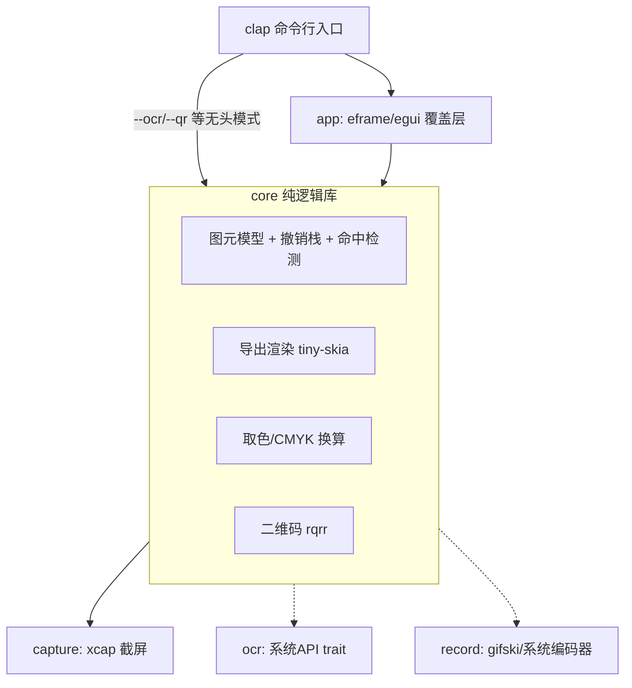

# LaterScreen 项目计划

跨平台截图工具（Windows / macOS / Linux），Rust 实现。目标对齐 Snipaste 级别的体验：
截图、标注、取色、二维码、OCR、录屏（GIF/MP4）、滚动长截图；单文件、体积小、启动快、小而美常驻。

## 1. 非功能性目标（硬约束）

| 约束 | 目标 | 实现手段 |
|---|---|---|
| 体积 | 最终产物 ≤ 20MB | `opt-level="z"` + fat LTO + strip + `panic="abort"`；避免重型依赖 |
| 单文件 | 无需安装、不依赖动态库 | 静态链接；OCR 模型按需下载、不捆绑 |
| 启动 | 冷启动 < 300ms 出选区 | 无运行时、按需初始化、截屏与窗口创建并行 |
| 内存 | 常态 < 100MB（全屏图 + 双缓冲） | 单份截图内存 + 图元矢量数据，不做多余拷贝 |
| 小而美常驻 | 托盘常驻进程空闲 < 30MB | 常驻体只持有托盘图标 + 配置 + 热键监听，**不预载截图缓冲**；截图/贴图/录屏各自独立窗口，用完释放。CLI 单次调用仍是即起即退 |

## 2. 架构

核心原则：**core 不依赖任何 UI**；CLI 与 GUI 是 core 之上的两个薄壳；
平台差异全部收敛在 platform 抽象层。



### Crate 划分

```
crates/
  core/      lscreen-core     图元模型、撤销栈、命中检测、导出渲染、取色、二维码
  capture/   lscreen-capture  截屏（xcap 封装，屏蔽 X11/Wayland/多显示器差异）
  app/       lscreen          可执行文件：clap CLI + egui 覆盖层
  ocr/       lscreen-ocr      trait + 三平台实现（M3）
  record/    lscreen-record   录屏编码（M4）
  setup/     lscreen-setup    Windows 自绘安装器（egui 单屏向导，替代 NSIS；
                              构建期经 LSCREEN_BIN 内嵌主程序，per-user 安装）
```

### 关键设计决策

1. **双渲染路径**：交互期用 `egui::Painter` 实时绘制（GPU/glow），导出时用
   `tiny-skia` 在 core 内软渲染合成到截图上。两者共享同一份图元数据与几何参数
   （箭头头长、马赛克格子等来自 `Element` 方法）。一致性承诺：**几何一致、
   视觉近似**——文本因 epaint 与 ab_glyph 的光栅化差异（hinting/AA/字距）
   无法做到像素一致，马赛克通过共用 `mosaic_cells` 做到像素一致。
   代价是每种图元两份绘制代码，新增图元时两边都要写。
2. **撤销/重做用快照而非命令模式**：图元是小矢量数据（每个几十字节），
   全量快照 `Vec<Vec<Element>>` 实现简单且绝不出错。图片本体不进快照。
3. **马赛克 = 网格色块**：按笔迹覆盖的网格单元，从原图计算均值色，
   交互层画色块矩形、导出层同样画色块，两边像素级一致。
4. **橡皮擦 = 原图回贴**：按绘制顺序渲染，橡皮擦笔迹用原图对应区域贴回，
   天然擦掉此前的所有标注。
5. **系统 API 优先 + 内置兜底**：OCR（Win `Windows.Media.Ocr` / mac Vision）、
   MP4 编码（Win Media Foundation / mac VideoToolbox）都走系统自带能力，
   零体积零依赖；系统能力未落地前由内置 ocrs 引擎兜底（纯 Rust，模型按需下载）。

## 3. 技术选型

| 功能 | 选型 | 备选/说明 |
|---|---|---|
| UI | egui (eframe 0.35) | 即时模式适合画布高频重绘；备选 winit+tiny-skia 纯软渲染（体积极限方案） |
| 截屏 Linux | **自研：x11rb（X11，纯 Rust）** | Wayland 走 ashpd portal（M5，纯 Rust D-Bus）。弃用 xcap Linux 路径：它强制链接 pipewire C 库，违反"无动态库依赖"目标 |
| 截屏 Win/mac | xcap | 这两个平台走系统 API，无 C 编译依赖 |
| 交互渲染 | egui Painter | — |
| 导出渲染 | tiny-skia | 纯 Rust 2D 软渲染 |
| 文本光栅化 | ab_glyph | 字体运行时从系统加载（fc-match / 平台字体目录），不捆绑 |
| 图像编解码 | image | PNG/JPEG 导出 |
| 剪贴板 | arboard | 支持图像写剪贴板，三平台 |
| CLI | clap (derive) | 子命令直达功能 |
| 二维码 | rqrr | 纯 Rust |
| GIF 编码 | gifski | 纯 Rust，质量最好 |
| MP4 编码 | openh264（Linux，静态链接 C++ 源）+ mp4 crate 封装 | Win MF / mac VideoToolbox 系统编码器待实现；零体积方案 |
| OCR | 系统 API + 内置 ocrs | Win `Windows.Media.Ocr` / mac Vision / Linux tesseract 子进程；内置 ocrs 纯 Rust 兜底 |

## 4. 里程碑

### 版本历程

| 版本 | 日期 | 交付内容 |
|---|---|---|
| v0.1.0 | 2026-08-18 | M1 截图标注、M2 取色/二维码/CLI、M3 OCR（Linux tesseract）、M4a GIF 录屏、M6 工具栏图标化；四种原生包格式 + dmg |
| v0.2.0 | 2026-08-19 | M7 贴图（独立进程 + 缩放/拖拽/工具条）、Win/mac 系统 OCR、内置 ocrs 兜底、Windows 自绘安装器替代 NSIS |
| v0.3.0 | 2026-08-20 | M8 托盘常驻 + 配置面板 + 全局热键（空闲 RSS ≈ 9MB） |
| v0.4.0 | 2026-08-21 | M4 MP4 录屏（openh264 静态链接）、滚动长截图、M5 Wayland portal 整屏、M9 窗口截图（默认截当前窗口）；任务栏图标归属修复 |
| v0.5.0 | 2026-08-25 | M10 录制选区边框 + 识别结果面板可拖拽缩放、M11 截图历史面板；录制 armed 待开始 + 边框闪烁 + 录制格式进配置 |
| v0.5.1 | 2026-08-25 | 修 Windows 缺 VCRUNTIME140.dll 打不开（MSVC 默认动态链 CRT，违反硬约束）；打包期新增导入表校验（未公开发布，内容并入 v0.6.0） |
| **v0.6.0** | **2026-08-25** | **启动失败不再静默：panic hook + 无控制台时弹窗上报、OpenGL 不可用时给出可自救指引；打包修 GNU 产物混入 dist（加 -localtest 后缀）与 7z 分支的目录前缀** |
| v0.6.1 | 2026-08-25 | macOS 修到能用：录屏/滚动截图选区后不再消失（同进程跑不了第二个事件循环，框选后 re-exec 转交）、托盘左键弹菜单（不再叠加截图）、托盘不占 Dock（Accessory）、历史面板移到右上角 |
| **v0.7.0** | **2026-08-26** | **多屏与 Wayland：双屏跨屏覆盖层（`_NET_WM_FULLSCREEN_MONITORS` 铺满虚拟桌面，可跨屏框选）、Wayland 交互式 portal 截图 + GlobalShortcuts 全局热键；修滚动截图无法滚动时像崩溃（退化普通区域截图）、托盘退出关历史面板、滚动截图选区边框、预览长图 Select 可拖动** |
| v0.7.1 | 2026-08-29 | 健壮性：修 tesseract 管道互等死锁隐患（stdin 写入挪独立线程）、历史 index.toml 原子写（tmp+rename）、Win/mac 托盘创建失败降级仅热键常驻；history/export 补 32 个单测（详见「已修缺陷 review 2026-08-29」）、CI 增 cargo audit 供应链门槛 |
| **v0.8.0** | **2026-08-31** | **三平台能力对齐：Windows/macOS 滚动长截图（SendInput / CGEvent 合成滚轮+指针）、Win/mac 录屏与滚动截图范围红框（画选区外侧保证不入镜）、mac 高分屏区域截图物理↔逻辑坐标换算修复；修 history 测试写真实缓存目录致 CI 自 v0.7.1 全红、release 矩阵砍 armv7/i686/rpm（0 下载，附件 23→13）** |
| v0.8.1 | 2026-09-01 | 修复：历史面板位置三平台错乱（构建期物理像素喂 with_position 而 egui 按逻辑坐标解释，Win 缩放 125%/150% 飞屏、mac Retina 坐标系不一致、Linux 压 dock）——改首帧 OuterPosition 逻辑坐标定位；新增位置记忆（cache/history.pos，恢复前校验仍在桌面内，拔屏回退默认防「打开即消失」）；默认摆放避让系统栏（mac 右上菜单栏下、Win/Linux 右下任务栏上） |
| v0.8.2 | 2026-09-11 | 配置窗口与历史面板支持浅色/夜间/自动主题；修复 Windows 安装器暗色输入框文字不可见；修复主题切换下的 UI 配色与配置布局 |
| **v0.9.0** | **2026-09-15** | **M12 贴图增强：Shift+滚轮调不透明度（20–100%）、点击穿透（Esc/托盘恢复）、R/H/V 旋转翻转、≥8x 像素网格、工具条缩放控件与参考风格图标重绘；托盘贴图菜单收进「贴图 ▸」子菜单（显示贴图/关闭穿透/关闭所有贴图），修复 Win/mac 两个管理项点击无响应；修复夜间模式设置输入框不可见（描边宽度被 Stroke::NONE 吃掉）** |
| **v0.10.0** | **2026-09-17** | **M13+M14+M15 一批交付。M13 截图体验：记忆上次选区（布局变化自动作废）、延时截图（CLI/托盘/热键）、文字标注背景色、取色历史、二维码生成。M14 录屏增强：录制点击高亮（扩散圆环，配置可关）；录屏音频三平台（Linux=arecord/parec+ffmpeg 子进程链，Win=WASAPI+Media Foundation，mac=CoreAudio 麦克风+AudioToolbox AAC——Win/mac 为盲写+CI 编译验证，真机点验待办；mac 系统声待 ScreenCaptureKit，配置降级麦克风），armed 预热+零点对齐、双源饱和混音、收尾对账；配置面板「录制音频」下拉三平台放开。M15 分享：可插拔上传 hook（[upload] 外部命令，stdin 传路径无注入面，stdout 首行 URL 自动复制+入历史，覆盖层/贴图「上传」按钮）。修复 Win/mac 托盘缺「延时截图」项** |
| v0.10.1 | 2026-09-17 | M17 真机验证套件第一批（env 门控 e2e：窗口枚举/截屏、系统 OCR、录屏音频，手册 docs/VERIFY.md）；Win 真机点验修复 M14 盲写缺陷 ×3——就绪信号时机（启动必超时）/ MFT 码率字节单位漏除 8 / 编码线程缺 COM 初始化，**v0.10.0 的 Win 录屏音频实际不可用，本版恢复**；实测认知修正：loopback 无渲染流时不产包（非持续静音包）；windows-only clippy 违规 ×3（CI 在 Linux 不可见） |

后续版本（规划，随交付滚动更新，勿在发布后回填改写）：

| 版本 | 内容 | 状态 |
|---|---|---|
| v0.11 | mac 系统声内录（ScreenCaptureKit，M14 遗留）：已落地，盲写 + 交叉编译验证，真机点验待办；M16 评估完成——维持 openh264 不切换（见 M16 节），本版无编码器改动 | 开发中 |
| v1.0 | M17 真机验证台账清零 + README/文档全量校对；此后进入维护期（缺陷修复为主） | 规划中 |

### M1 截图 + 标注 ✅（核心价值）
- [x] workspace 骨架 + 体积优化 profile
- [x] core：图元模型（矩形/椭圆/箭头/直线/曲线/标号/文本/马赛克/橡皮擦）、
      样式（颜色/线宽/字号）、命中检测、撤销/重做
- [x] capture：多显示器截屏
- [x] app：全屏覆盖层、区域框选（可调整边缘）、工具栏、绘制交互、
      Shift 约束（正圆/正方形/水平垂直直线）、悬停选中/拖拽移动/删除
- [x] 快捷键：Ctrl+Z 撤销、Ctrl+Y 重做、Ctrl+S 存文件、Ctrl+C/双击 进剪贴板、Esc 退出
- [x] 导出：tiny-skia 合成 → PNG 文件 / 剪贴板

### M2 取色器 + 二维码 + CLI ✅
- [x] 取景框放大镜（像素级十字线 + 周边像素放大）
- [x] Ctrl+R 复制 RGB / Ctrl+H 复制 HEX / Ctrl+K 复制 CMYK
- [x] 框选区域内二维码识别（rqrr）
- [x] CLI：`lscreen`（交互截图）、`lscreen shot --region x,y,w,h -o f.png`、
      `lscreen pick`（取色）、`lscreen qr`、`lscreen ocr`

### M3 OCR ✅
- [x] `TextRecognizer` trait；识别结果浮层展示 + 一键复制
- [x] Linux：探测系统 tesseract 可执行文件调用（中文方案，未安装时明确引导）
- [x] 内置 ocrs 兜底引擎：纯 Rust 零依赖，系统引擎缺失时的最终兜底；模型约 4MB
      按需下载到 `~/.cache/ocrs`，仅拉丁字母文字（CJK 需 tesseract）
- [x] Windows（Windows.Media.Ocr）/ macOS（objc2 + Vision）原生 OCR ✅（2026-08-18）
- [x] Windows/macOS 原生 OCR 真机验证（CI 无桌面环境，需双系统手动确认）

### M4 录屏 + 滚动截图（技术风险最高，放最后）✅ 2026-08-20
- [x] 选区连续采帧 → gifski 编码 GIF（✅ 已交付 `lscreen record`）
- [x] MP4：Linux 走 **openh264 静态链接**（vendored C++ 源，无动态库依赖；
      无 asm 构建——CI 无 nasm 也能编译，发布可开 asm 提速）+ `mp4` crate
      封装（AnnexB→AVCC、SPS/PPS→avcC）。CLI：`record --mp4`
      （此时 `--quality` 语义 = 目标码率 kbps 200-50000，缺省 4000）。真机验证：
      ffprobe 读回 h264/Constrained Baseline、时长帧数正确、ffmpeg 可解码；
      码率控制 Bitrate 模式 + Constrained Baseline 兼容性最好。
      Win/mac 系统编码器（MF/VideoToolbox）待实现——发布体积预算内
      （12.4MB ≤ 20MB）。失败路径与 GIF 同语义：清半成品、join 编码线程。
      （后续澄清：openh264 实际三平台统一编译，Win/mac 的 `--mp4` 今天
      即可用；系统编码器只是优化项，规划见 M16）
- [x] 滚动截图：`lscreen scroll`（托盘菜单「滚动截图」同入口）。
      capture 层新增 XTest 滚轮/指针控制（`scroll_wheel`/`warp_pointer`，
      x11rb xtest 特性，FakeInput 后 sync 保证时序）；record 层
      `ScrollStitcher` 帧间拼接：尾部块（区域高 1/6，钳 16–96 行）两阶段
      匹配——签名行（4px 降采样亮度）预筛候选 + 整块 SAD 校验（阈值
      8/255，容抗锯齿噪声），Anchor=块末行定位（起点 = p-(k-1)）。
      交互：框选区域 → 指针移到区域中心驱动滚动 → 状态窗显示拼接高度
      （连续 2 帧无新增 = 到底；内容突变 = 保留已拼部分停止）→ **标注预览
      窗口**（复用 SnipApp 会话，preview 标志）：可滚动画布（首帧适应宽度、
      内容水平居中）+ **完整截图标注工具栏**（矩形/椭圆/箭头/直线/画笔/
      标号/文本/马赛克/橡皮擦、颜色/粗细、撤销重做、保存/贴图/二维码/OCR/
      复制退出）——长图与普通截图同一套标注体验；选区固定整图（禁手柄），
      文本编辑器锚点改用画布帧缓存视图（预览下 content_rect ≠ 画布 rect）。
      预览缩放：Ctrl+滚轮/触摸板捏合（egui zoom_delta）+ Ctrl+=/− 步进 +
      Ctrl+0 适应宽度，锚定指针位置（滚动偏移随缩放补偿）；窗口最小宽
      640 容纳底部工具栏，工具栏过窄时靠左钳住保证可达。
      预览平移：中键拖动任意处 / 「选择」工具左键拖空白；绘制类交互统一
      改用 dragged_by(Primary)，中键与画图不再互抢。
      超 GPU 单纹理上限（8192）的长图显示用整数因子降采样纹理兜底
      （避免上传失败/驱动静默裁剪），保存/复制/OCR 仍走全分辨率原图。
      显式 `-o` 保持直存旧行为（脚本用法）。结束恢复指针原位。
      真机验证：xterm+tail -f 滚动内容 30 步拼出
      604×2860 长图逐行一致。已知限制：悬浮表头/固定侧栏返回 Mismatch
      即停（保已有部分）；区域内动画内容会误判；仅 Linux X11。
      真机 E2E 受宿主终端滚轮行为干扰（xterm 对持续输出会自动跳回底部
      scrollTtyOutput、alt-screen 不转发滚轮），理想宿主是浏览器/编辑器

### M5 打磨
- [x] Wayland portal 路径 ✅ 2026-08-20：`lscreen-capture` 集成 ashpd
      （纯 D-Bus，`screenshot`+`async-io` 特性，zbus 由 workspace 统一钉
      5.18）。纯 Wayland 会话时 `capture_primary/at/all` 走
      xdg-desktop-portal Screenshot（interactive=false 免对话框），返回
      文件解码（PNG/JPEG 视 DE——Deepin 后端给 JPEG，已兼容）后读后即删；
      区域采帧/录屏/指针/窗口枚举在 Wayland 下明确报错或降级。
      真机验证（Deepin 25 portal，X11 会话模拟 Wayland 环境变量）：
      D-Bus 链路通、返回双屏拼接 3840×1080。待办：真实 Wayland 会话
      （GNOME/KDE/wlroots）的覆盖层 GUI 体验——portal 快照是「全部显示器
      拼接、origin(0,0)」，与单屏覆盖层窗口的坐标映射需逐 DE 验证，
      多屏混合 DPI 下可能错位（已知限制，随 M5 后续迭代）
- [x] **Wayland 交互式截图**（✅ 2026-08-26）：不再拿全桌面拼接图硬套自绘
      覆盖层（多屏混合 DPI 坐标必错）。Wayland 下 `run_gui`（Snip/Record）
      改走 `capture_interactive`（portal Screenshot `interactive=true`）——由
      **合成器弹原生框选/选窗 UI**，回来的就是裁好的选区，坐标由合成器保证，
      逐 DE 天然正确。选区图直接进 `preview` 标注窗（复用滚动截图/`annotate`
      的 SnipApp preview 路径：完整工具栏 + 保存/复制/贴图/OCR/二维码）。
      用户在 portal 取消 = 静默退出（不弹错）。代价：初次框选是系统 UI，
      没有自绘覆盖层的实时放大镜/取色（Pick 取色模式无对应 portal 交互，
      仍走原降级路径）。`is_wayland()` 门控，X11 行为零改动（实测覆盖层仍
      跨屏 3840×1080）。真机 Wayland 待验（本机 Deepin 是 X11 会话）
- [x] **Wayland 全局热键**（✅ 2026-08-26）：X11 的 `global-hotkey` 在 Wayland
      整体失效（原先只告警降级、无热键）。改经 `org.freedesktop.portal`
      `.GlobalShortcuts`（ashpd `global_shortcuts` 特性）：`run_global_shortcuts`
      在托盘的独立线程里 create_session + bind_shortcuts + 阻塞监听 Activated
      信号，触发时把 Action 塞进与菜单同一条 tx 通道走同一 dispatch。配置里的
      热键字符串转成 XDG 规范的**建议触发键**（最终绑定由合成器/用户在系统
      设置里定夺，与 X11 直接抢键的语义不同）。合成器不支持 GlobalShortcuts
      （如部分 DDE portal 后端）时线程内 Err 退出，托盘菜单不受影响。
      `is_wayland()` 门控，X11 仍走 global-hotkey。真机 Wayland 待验
- [ ] 多显示器混合 DPI：X11 下 scale 恒 1 自洽；Win/mac 经 xcap 的
      scale_factor 换算（M9 已处理 mac 窗口矩形）；X11 xrandr --scale
      的假混合 DPI 与 Wayland 多屏拼接映射待真机验证
- [ ] 多屏窗口定位真机验证：`with_position + with_fullscreen` 在部分 WM 上
      fullscreen 可能忽略 position hint 落错屏（CI 测不了，需双屏手动确认）
      ——✅ Deepin 25 (KWin/X11) 双屏实测通过（2026-08-17）：覆盖层正确落在
      鼠标所在屏；其他 WM（GNOME/i3 等）待社区反馈
- [x] **跨屏覆盖层**（✅ 2026-08-26，Linux X11）：原覆盖层只截「鼠标所在屏」+
      `with_fullscreen` 钉该屏，双屏下无法跨屏框选、另一块屏既不变暗也不可交互、
      窗口吸附只看得到本屏窗口。改法：`capture_overlay`（main.rs）在多屏 X11 下走
      `monitor_bounds()`+`capture_region()` 抓整个虚拟桌面为**单缓冲**（X11 scale
      恒 1，单缓冲即可覆盖全部屏；`window_rect_in_image` 对任意 origin 都正确，
      吸附/取色/选区无需改坐标）。单屏（union==主屏）或非 1 缩放（假混合 DPI）
      回退老路径，行为不变。**跨屏铺满靠 EWMH `_NET_WM_FULLSCREEN_MONITORS`**：
      仅去 `with_fullscreen`+手动 pos/size 会被 WM 按工作区钳回单屏（实测
      3840→1920×1008）；保留 fullscreen 再发这条 ClientMessage（data=四至各自
      的显示器编号+source）让 WM 把 fullscreen 窗扩到全部屏。**时序坑**：建窗
      （CreationContext）阶段发会被 KWin 丢弃（窗口尚未 map/fullscreen），故
      SnipApp 在前 8 帧每帧重发（`pump_span`，配 `request_repaint`），成功即维持。
      WM 不支持该原子时无副作用，自然退回单屏 fullscreen。实测 Deepin 25
      (KWin/X11) 双屏 DP-1(0,0)+DP-3(1920,0)：`gui` 与 `record --select` 覆盖层
      均铺满 3840×1080，`_NET_WM_FULLSCREEN_MONITORS=0,0,0,1`，两屏内容都在单缓冲里
      （右屏非黑样本 5184）。Win/mac/Wayland 维持现状（混合 DPI 单缓冲不可靠，
      见上「混合 DPI」条）；其他 WM 待社区反馈
- [x] CI：三平台构建产物 + 体积回归检查（见 .github/workflows/ci.yml，含
      fmt/clippy 门槛）；openh264 静态链接后 release 12.4MB（预算 20MB 内，
      2026-08-20 实测）。远期注意：ldd 白名单对全静态产物会误报

### M6 界面打磨：图标化工具栏（✅ 2026-08-18）

原状：15 个中文文字按钮横向占用超过 620pt，小屏或窄选区下挤压严重。

- [x] 工具栏按钮改为图标 + hover tooltip（含快捷键提示）
- [x] 图标方案调整：**全部 Painter 手绘 12px 矢量线稿**（比 Unicode 符号更稳——
      不赌 emoji 字体覆盖，任何系统渲染一致；仅标号「1」与 OCR「A」用拉丁字形）。
      不引入 SVG 库、不打包 PNG 图集
- [x] 按钮统一 24×24，间距 2pt，整条工具栏约 470pt（原 620+）
- [x] 颜色选择器改为单个当前色按钮 + 点击展开调色板 popup（egui 0.35 `Popup::menu`）
- [x] 每个图标按钮有 `on_hover_text` 完整文案，禁用态（撤销/重做）灰显不可点

### M7 贴图（Pin to screen）✅ 2026-08-18

Snipaste 的招牌能力：截完把图钉在屏幕上置顶悬浮，方便对照。

- [x] 新增 `lscreen pin` 子命令 + 覆盖层工具栏「贴图」按钮（Ctrl+P）
- [x] 实现：合成当前选区 → 开一个新的 eframe 窗口
      （`with_always_on_top` + `with_decorations(false)` + `with_resizable(false)`），
      窗口初始位置对齐原选区，尺寸等于选区。
      **未用 with_transparent**：贴图内容本身是不透明位图，透明窗口无收益
      且依赖合成器行为，刻意省略
- [x] 交互：拖拽移动窗口（手动定位：指针屏幕坐标取 X11 QueryPointer 绝对值，
      弃用 StartDrag——未激活窗口首次按下被 WM 吞；也弃用 egui 局部坐标增量
      ——窗口被程序移动时静止指针无 MotionNotify，陈旧坐标会自激「乱跑」）、
      滚轮缩放（25%–400%，光标下的图像点锚定不动：InnerSize + OuterPosition
      联动换算）、双击复制、Esc/Delete 关闭
- [x] 图像下方条带工具条：置顶切换/保存/关闭/复制并关闭（复用 ui::toolbar 手绘图标，与
      覆盖层风格一致）；快捷键 Ctrl+C 复制 / Ctrl+S 保存；缩放百分比 toast。
      曾做右键菜单：未激活窗口的右键常被 WM 拿去做焦点转移、时常不弹，弃用
- [x] 生命周期决策：**贴图窗口独立进程**（`lscreen pin` 由覆盖层 spawn 后自身退出）。
      每个贴图是一个只持有一张图的轻量进程，符合「小而美常驻」：常驻体积随贴图数
      线性增长且各自可独立关闭，不共享一个越用越大的主进程。
      图片经 stdin 以 PNG 传入（父进程写完再退出，无临时文件与清理问题）
- [x] 内存：贴图进程只保留一份 RGBA + 纹理，常态目标 < 60MB
- [x] CLI 防呆：无 -i 且 stdin 是 tty 直接报错（不阻塞等 EOF）；
      --pos/--scale 校验前置；负坐标支持（`--pos=-1920,0` 或
      allow_hyphen_values 的空格写法）

### M8 托盘 + 配置面板 ✅ 2026-08-19

托盘是「小而美常驻」的主形态：一个空闲 < 30MB 的常驻体，负责热键监听与配置，
截图/贴图/录屏窗口按需开、关掉即释放。CLI 子命令单次调用仍是即起即退，两种用法并存。

- [x] **默认行为变更（用户决策）**：裸 `lscreen` = 静默驻留后台托盘（分离子进程，
      终端立即返回）；`lscreen gui` 直达交互截图；`lscreen tray --foreground` 前台
      调试/自启动
- [x] 托盘选型落地：**Linux 用 ksni**（纯 Rust 的 StatusNotifierItem/D-Bus 直连，
      零动态库依赖——tray-icon 的 Linux 后端要链接 gtk/libappindicator，违反硬约束，
      弃用）；Win/mac 用 tray-icon（系统原生 API），事件泵复用 eframe 已链接的
      winit 0.30（macOS 要求托盘在主线程已运行的事件循环上创建）
- [x] 托盘菜单：截图、取色、贴图（读剪贴板）、录屏（`record --select` 交互框选）、
      滚动截图、历史、配置、退出；菜单项带热键后缀；Linux 左键单击弹菜单
      （MENU_ON_ACTIVATE），activate 兜底为直接截图
- [x] 配置面板（`lscreen config`，settings_ui.rs）：保存目录、文件名模板、
      默认工具/颜色/线宽、复制后自动退出、保存后打开目录、历史条数/复制后收面板、
      六个全局热键；保存前全部校验（模板/热键/颜色/工具名），非法只提示不落盘
- [x] 全局热键：`global-hotkey` crate（托盘进程内自监听）；**默认 F1 截图**
      （Snipaste 惯例——实测 Ctrl+Alt+A 与 Deepin 系统截图键冲突）；注册失败/
      Wayland 无 X11 时仅告警降级，托盘与菜单不受影响；裸键仅允许
      PrintScreen/F1-F12（裸字母会全局抢占打字）
- [x] 配置持久化：`~/.config/lscreen/config.toml`（Win `%APPDATA%`、
      mac `~/Library/Application Support`）；`toml` + serde，未知字段忽略、
      缺失字段取默认
- [x] 零配置：无文件时静默全默认（不生成文件不告警），配置面板保存才落盘；
      托盘每秒轮询 mtime，面板保存后 1 秒内热加载（热键重注册、菜单文案更新）
- [x] 截图窗口接入配置：默认工具/颜色/线宽初始值、复制后是否自动退出
      （关闭时不退只 toast）、保存目录与文件名模板、保存后打开目录
- [x] 附带交付：`record --select`（框选即录，Esc 取消静默退出）
- [x] 录屏状态窗口（2026-08-19 补）：录制在独立线程跑 `record_gif`，主线程跑
      置顶状态窗口（已录时长/帧数/进度条 + 停止按钮），Esc 或按钮停止、关窗即停；
      托盘 spawn 的录屏子进程脱离终端也能正常结束（此前只能等 --duration 超时）；
      配置面板黑屏修复——egui 0.35 移除 TopBottomPanel 后改用 Panel::bottom +
      CentralPanel 分域（原 allocate_rect 手动分域会把 ScrollArea 挤到底部 40px 条带）
- [x] 常驻内存实测（Deepin 25 / X11）：托盘空闲 RSS ≈ 9MB（目标 ≤ 30MB）；
      热键 F1/F2 唤起截图、菜单动作、托盘退出、配置热加载真机验证通过
- [ ] Win/mac 托盘真机验证（tray-icon + winit 路径，CI 无桌面需手动确认）
- [x] 依赖备注：ksni blocking 需 async 运行时，选 async-io（比 tokio 轻）；
      **zbus 钉 =5.18.0**（5.19 在 default-features=false + blocking-api 组合下
      自身编译失败，上游打包缺陷，修复后放开）
- [x] 任务栏图标归属修复（2026-08-21）：egui 的 `with_app_id` 只在 Wayland 生效，
      X11 下 winit 不设 WM_CLASS、回落到窗口标题（实测 `WM_CLASS="" 标题`），
      任务栏匹配不到 lscreen.desktop 就用错图标（显示成启动来源的 VS Code）。
      修复：app 各窗口构造时经 raw-window-handle 取 X11 window id → capture
      新增 `set_window_class`（x11rb change_property8 显式写 `WM_CLASS="lscreen"`）；
      desktop 补 `StartupWMClass=lscreen`；所有 ViewportBuilder 补
      `with_app_id("lscreen")`（Wayland 侧对齐）。X11 实测 pin 窗口 WM_CLASS
      已变为 `("lscreen","lscreen")`
- [x] 窗口图标兜底（2026-08-21）：任务栏图标走 `.desktop` 的 `Icon=lscreen` 依赖
      hicolor 缓存，目录尺寸不符（997×977 放在 256x256）或缓存未刷新会回退旧图。
      补 capture `set_window_icon`（`_NET_WM_ICON`，CARDINAL 数组 ARGB），窗口构造
      时直接给任务栏/alt-tab 图标，不依赖缓存；源图统一 resize 为 256×256 正方形
      （build.rs ICO 要求正方形）。实测窗口 `_NET_WM_ICON` = 64×64 已生效

### M9 窗口截图（选中最前窗口，默认截当前窗口）✅ 2026-08-20

Snipaste/系统截图的基础体验：进入截图时不必手动框选，**默认选区就是当前
最前面的窗口**；移动鼠标时自动高亮悬停处的窗口，单击即选中该窗口区域。

设计原则：**窗口矩形只用来「吸附选区」，像素仍来自已截好的全屏图**。
不做单窗口独立采集（XGetImage 单窗口 / PrintWindow / CGWindowListCreateImage），
避免被遮挡窗口内容缺失、DWM 圆角阴影裁剪等一堆平台坑；截图语义 =
「屏幕上此刻看到的这个窗口区域」，与现有覆盖层管线零冲突。

- [x] capture 新增窗口枚举 API：
      `WindowInfo { id, title, x/y/w/h, z_order, is_minimized }` +
      `list_windows() -> Vec<WindowInfo>`（按 Z 序自顶向下）+
      `frontmost_window() / window_at(x,y)` +
      `window_rect_in_image()`（平台坐标 → 显示器图像像素，含求交；
      mac 的 CG 逻辑点 → 物理像素换算收敛在此，不泄漏到 app）
      - Linux X11（x11rb，纯 Rust）：`_NET_CLIENT_LIST_STACKING` 取 Z 序，
        `_NET_ACTIVE_WINDOW` 取最前窗口；几何用 GetGeometry +
        TranslateCoordinates 折算到根坐标，`_NET_FRAME_EXTENTS` 补装饰边框；
        过滤 `_NET_WM_STATE_HIDDEN`（最小化）、非当前桌面（`_NET_WM_DESKTOP`，
        sticky 保留）与 DOCK/DESKTOP/MENU 等辅助窗口类型；无 EWMH 的 WM
        返回空列表降级。x11rb 0.13 的 `value32()` 返回 Option 迭代器，
        统一经 `values32()` 展平
      - Windows / macOS：xcap `Window::all()`（两平台天然按 Z 序自顶向下），
        最前窗口 Win = GetForegroundWindow、mac = 活跃 App（xcap `is_focused`）；
        最小化/零尺寸过滤
      - Wayland：portal 无窗口几何能力，返回空列表明确降级为纯手动框选（不报错）
- [x] 关键时序：**窗口列表必须在覆盖层窗口创建前采集**（`overlay_window_list`
      与截屏同时机），否则覆盖层自己就是最前窗口；按 `_NET_WM_PID` +
      `/proc/<pid>/exe` == 自身可执行文件排除自家窗口（贴图/录制状态/配置
      面板——它们是同 exe 的独立进程；覆盖层自身尚未建窗天然不在列表）；
      Win/mac 按 xcap `app_name` 与自身 exe 文件名比对
- [x] 覆盖层交互（对齐 Snipaste）：
      - 进入截图：初始选区 = 最前窗口矩形（与屏幕求交），一步 Enter/
        Ctrl+C/双击即可出图——「默认截图当前窗口」
      - 未按下拖拽时：鼠标移动实时命中悬停窗口（Z 序自顶向下第一个含点者），
        高亮其边框 + 左上角显示窗口标题；单击 = 选中该窗口并进标注
        （可拖边缘微调、可标注，复用现有全部 Editing 交互）
      - 一旦开始拖拽即进入自由框选，行为与现状完全一致
      - 双击 = 第一击选中窗口进标注、第二击触发现有「双击复制」链路，
        点击型工具（标号/文本）例外逻辑不变
      - 空白桌面单击 = 全屏（旧行为保留）；Record 框选模式同样受益
        （窗口单击/Enter 即交付该窗口区域）
- [x] CLI：`lscreen shot --window`（最前窗口直接出图；直接 capture_region
      抓窗口矩形，跨显示器窗口天然正确，优于「截主屏再裁剪」的旧路径）、
      `--window-at x,y`（取该点下窗口，供脚本用）；与 --region clap 互斥
- [x] 配置面板：新增「初始选区」选项（最前窗口/全屏/无），默认最前窗口；
      未知配置值回退默认；旧配置文件缺字段自动取默认
- [x] 验收（Deepin 25 / KWin / X11 真机 2026-08-20）：窗口枚举 Z 序/
      标题/几何正确（含最大化窗 frame extents 与 +1920 副屏坐标）、
      frontmost = 活跃窗口、`shot --window` / `--window-at` 出图尺寸与
      窗口一致；覆盖层交互路径（初始预选/悬停高亮/单击选窗/Enter 出图）
      已实现待人工点验。Win/mac 待真机确认（CI 无桌面）；mac 窗口坐标
      走「CG 点 × 窗口中心所在显示器缩放比」换算，混合 DPI 场景随 M5 一并验证

### M10 录制区域可视化 + 识别结果面板可拖动 ✅ 2026-08-24

两条来自实际使用的体验缺口：录制时看不见录的是哪块、识别结果框钉死在屏幕正中。

- [x] **录制期间常显选区边框**（✅ 2026-08-24）：现在 `run_record` 只开一个
      320×150 的状态窗口（main.rs:715），选区本身没有任何视觉标记——录到第 10 秒
      已经不记得框的是哪里，也无法确认目标窗口有没有移出框外。目标：录制全程在
      选区周围显示常亮/虚线边框，停止即消失。
      - **关键约束：边框不能被录进帧里**。`capture_region` 抓的是屏幕实际像素，
        任何压在选区内的装饰都会出现在成品里。因此边框画在选区**外侧一圈**
        （矩形向外扩 2px），选区内像素一个不碰。同理状态窗口若与选区重叠也会被录进去，
        需要避让（选区外的空白角落，无处可放时才允许重叠并明确提示）
      - 实现选型（Linux X11 优先，与滚动截图同策略）：capture 层新增 4 条细长
        override-redirect 窗口（上/下/左/右边条）而非一个带洞的透明窗口——
        避免依赖合成器的透明与 XShape 挖洞行为（贴图窗口已有「不赌合成器」的先例，
        见 M7）。纯 x11rb 创建、填色、置顶，无 GUI 框架开销；
        用 XShape 的 ShapeInput 设空输入区做点击穿透，边条不抢鼠标
      - 边界情形：选区贴屏幕边缘时外扩超出虚拟桌面 → 钳到桌面范围，接受边框缺一侧
        （不退化成画在选区内，那会污染成品）；多屏跨越选区按虚拟桌面坐标处理
      - 生命周期：RAII guard 持有边条窗口，录制线程正常结束/出错/用户停止/进程
        panic 都要销毁，绝不留残影窗口在屏幕上
      - Win/mac 与 Wayland：先不做，同滚动截图的平台策略（Wayland portal 无法
        创建 override-redirect 覆盖窗）；缺失时录制行为不变，仅无边框
      - **落地记录**：`capture::record_border(x,y,w,h) -> Option<RecordBorder>`，
        guard Drop 即销毁（连接随 guard 存活）。`monitor_bounds()` 一并导出。
        `run_record` 用 `status_window_pos` 把状态窗摆到不与选区重叠的桌面角落
        （右下优先逆时针，纯函数有单测；仅 Linux——Win/mac 多屏 DPI 逻辑坐标
        换算不可靠，维持 WM 默认摆放），四角都避不开（如全屏录制）时显示
        「会被录入成品」橙色提示。实测（Deepin/X11）：边条约 200ms 后可见
        （合成器重绘延迟，录制场景无影响），选区内 0 边条像素、drop 后 0 残影。
- [x] **识别结果面板可拖动 + 可缩放**（✅ 2026-08-21）：QR / OCR 结果窗口
      （ui/mod.rs:683 `show_results`）原先 `.anchor(Align2::CENTER_CENTER)` +
      `.resizable(false)`。**anchor 就是拖不动的根因**——egui 对锚定窗口每帧强制
      写回位置，拖拽位移当帧即被覆盖；而结果框恰好盖在选区中央，挡住的正是刚识别
      的那段原文，无法对照校对
      - anchor 换成 `.default_pos(viewport_rect().center())` + `.pivot(CENTER_CENTER)`：
        pivot 让 default_pos 仍按窗口中心解释，保住首帧居中的观感，之后位置交给
        egui 记忆。注意 egui 0.35 的入口是 `InputState::viewport_rect()`，
        `screen_rect()` 已改名
      - `.resizable(true)` + `.min_width(260)` + `.constrain(true)`（防拖出屏幕外
        再也抓不回来）；`default_width` 460 / `default_height` 340 给初始观感
      - 高度改为随窗口走：`ScrollArea::auto_shrink([false, false])` 撑满，去掉固定
        `max_height(320)`（原先拉大窗口也看不到更多内容）。文本上限 600 → 4000 字，
        仍留上限是因为 egui 会为不可见文本做布局；「复制内容」始终复制完整原文
      - 覆盖层是全屏窗口，拖动在其内部完成，不涉及系统窗口移动；结果面板打开期间
        的按键屏蔽逻辑（ui/mod.rs:496，只留 Esc）保持不变
      - 滚动截图预览复用同一个 SnipApp 会话，自动同步受益

### 录制体验增强（2026-08-24，实际使用反馈）

- [x] **录制不直接开始（armed 状态）**：状态窗先显示「● 待开始」+
      「开始录制 (Enter)」按钮，点按钮或按 Enter 才开录；Esc/关窗/Ctrl+C
      在 armed 阶段 = 取消，静默退出（退出码 0，不产文件）。实现：
      `started: Arc<AtomicBool>`，录制线程进入采帧前先轮询等待（50ms 步进），
      stop 先到即取消；时长从真正开录起算。滚动截图无 armed（一进就滚）
- [x] **录制中边框红/蓝闪烁**：`RecordBorder::set_color`（改
      background_pixel + clear_area 强制重绘），run_record 的闪烁线程在
      started 后每 400ms 红蓝交替；armed 阶段保持静态红边。真机采样
      验证红蓝交替正确、边条仍在选区外侧
- [x] **录制格式进配置**：`config.toml` 新增 `record_format`（gif/mp4，
      默认 gif，非法值按 gif；旧配置无此字段走默认）。CLI `--mp4` 显式
      指定优先于配置。配置面板「保存」卡片加「录制格式」下拉。
      quality 缺省值改为按合并后的格式取（mp4=4000kbps / gif=90）
- [x] **`open_dir_after_save` 未覆盖录制/滚动**：原先只有 GUI 截图保存
      走自动打开目录；record（GIF/MP4）与 scroll `-o` 落盘后同样按配置
      打开所在目录

### M11 截图历史（托盘「历史」→ 缩略图面板，最近 10 张）✅ 2026-08-25

托盘菜单点「历史」打开一个**无边框置顶浮窗**（Snipaste 同款思路：原生菜单
画不了缩略图，用自绘窗口展示缩略图网格）。单击缩略图**复制**（截图/贴图）或
**打开目录并选中**（录屏）；右键贴图/打开/删除。解决「刚截的图找不到去哪了」
的高频痛点。

- [x] **记录时机**：历史 = 每次「产出图片」时追加一条记录，而非事后扫目录。
      原因：保存目录是用户任意指定的、可能混入非 lscreen 图片。写入点收敛在
      `history` 模块，各产出路径统一调用：
      - 截图保存（`ui/mod.rs` `save_and_exit`）、复制（`copy_and_exit`）
      - 贴图保存按钮（`pin.rs` `do_save`）、贴图创建（`pin_and_exit` +
        `pin_from_clipboard`）
      - CLI 直出（`main.rs` `run_shot` / `run_scroll` 显式 -o 分支）
      - **录屏落盘时**（`main.rs` `run_record`，GIF/MP4 都入）
- [x] **存储形态（小而美）**：独立历史目录 `~/.cache/lscreen/history/`
      （三平台 `config::cache_dir()`：Win `%LOCALAPPDATA%\lscreen`、
      mac `~/Library/Caches/lscreen`），每项存一份**全尺寸 PNG 副本**，索引 `index.toml`
      记录（时间戳、来源类型、尺寸，按时间倒序）。上限 `history_max`（默认 10，
      1-50），append 超限裁最旧。**存副本而非只记路径**：再复制/贴图必须能读到
      原图，源文件可能被移动或删除；自包含副本保证历史永远可点开。代价：磁盘约
      N×单张 PNG 大小（10 张 1080p 截图约 20–40MB，可控）。无历史时面板显示
      「暂无历史」占位，不报错不落盘。
      **为何是缓存目录而非配置目录**：历史副本是可再生的派生数据，删掉只丢便利、
      不丢设置；放 config 会让备份/同步工具连着几十 MB 图片一起搬，也违反 XDG
      语义（config 存"用户的选择"，cache 存"可随时丢弃的中间产物"）。**不做旧目录
      迁移**（用户定稿）：历史是易失数据，为它写一套跨文件系统搬迁+回滚不值得，
      老的 `<config>/history/` 用户自行删除即可。运行期小文件（单例锁、唤起信号）
      同样落 cache——它们也是「随时可丢」的状态。
- [x] **可见的体积 + 一键清空**：面板顶栏显示「历史 · N 张 · X MB」
      （`total_bytes()` 累加索引内文件 size），旁边「清空」按钮走二次确认
      （`confirm_clear` 状态，再点一次才执行）→ `clear_all()` 删所有副本 + 重写
      空索引。**只删索引登记过的文件**，不 `rm -rf` 目录，避免误删同目录他物。
      让"该清了"在 UI 上可见，而不是等用户自己翻磁盘发现几百 MB。
- [x] **面板浮窗（`history.rs` `HistoryApp`）**：`egui::Panel::top`(标题+计数+
      ✕) + `CentralPanel` 里 `ScrollArea` 缩略图列表。每行一张**满宽卡片**：左缩略图
      固定高 120px、按图高比缩放并**吃满行内剩余宽度**（横版图不再"框宽 item
      窄"），右栏类型/时间/分辨率三行居中、宽度随图片收敛（竖版窄图下文字保持
      配角）。悬停覆盖**整行**（含文字，红框 + 淡色底），**鼠标可拖拽滚动**
      （`ScrollSource::default() | DRAG`，egui 默认拖拽只在触摸屏生效）。
      单击按 kind 分流：Shot/Pin 复制、Record 用默认播放器播放 `source` 视频
      （`open_with_default`，不再打开缩略图）；点击/播放/打开都有**底部 toast 反馈**，
      按 `history_close_after_copy` 可在复制成功后自动收面板。右键缩略图
      贴图/打开目录/删除。`refresh_if_changed` 轮询 `index.toml` mtime，
      新截图落盘面板自动出现。Esc/✕ 关闭。
- [x] **托盘入口**：`tray.rs` 的 `Action::History` = `spawn_detached(["history"])`，
      `MENU_ACTIONS` 在「滚动截图」与「配置」之间插「历史」（Linux ksni 与
      Win/mac tray-icon 都走普通菜单项，不再用子菜单）。`main.rs` 恢复
      `Cmd::History` + `run_history`（280×420 无边框置顶窗 + `HistoryApp`），
      摆放改为**主屏右下**（`primary_monitor_bounds`）——Deepin 的 dock 在主屏，
      历史面板贴主屏而非虚拟桌面右边界。
- [x] **单实例（PID 锁）**：热键/菜单连按会不断 spawn 新 `lscreen history` 进程，
      叠出一堆面板。`acquire_single_instance()` 在 `run_history` 最开头抢
      `<cache>/history.lock`（内容 = 本进程 PID）：锁内 PID 仍存活则本进程直接
      退出，不建窗口；正常关闭时 `release_single_instance()` 比对 PID 后删锁。
      **存 PID 而非纯文件存在性**：进程崩溃留下的 stale 锁会被下次启动识别为死
      PID 并覆盖，不会把用户永久锁在门外。存活探测 `kill(pid, 0)`（unix，
      EPERM 也算活）/ `OpenProcess`（Windows）。
- [x] **再按热键把面板唤到前台**：单例只是「不开第二个」，面板在后台时用户会
      觉得按了没反应。第二个进程退出前留下 `<cache>/history.raise` 信号文件，
      运行中的面板 `poll_raise` 每 300ms 读一次，命中就消费掉并依次发
      `Minimized(false)` → `Visible(true)` → `Focus`（顺序有讲究：先恢复可见
      才有窗口可聚焦）。**关键是 `request_repaint_after(300ms)` 保持心跳**——
      窗口在后台没有输入事件，eframe 不会主动重绘，纯事件驱动永远轮询不到信号，
      这正是「按了热键像没反应」的根因。用文件而非 D-Bus/socket：面板本就轮询
      `index.toml` mtime 刷新列表，复用同一条轮询，不为一个信号引入 IPC 依赖。
- [x] **录屏缩略图**：GIF/MP4 均**录制时留首帧**——`record_mp4`/`record_gif`
      采帧时把第一帧 RGBA 存入共享槽，录毕另存 `_poster.png` 并记一条，
      `source` 指向实际 GIF/MP4 文件。**录屏点击不复制也不定位**：`source`
      存在且未失效时用系统默认播放器播放视频（`export::open_with_default`），
      源已删/旧条目无 source 时退化为打开目录。
- [x] **打开目录并选中**：`export::open_and_select(path)` 三平台定位文件：
      Windows `explorer /select`、macOS `open -R`、Linux FileManager1 D-Bus
      `ShowItems`（失败降级 `xdg-open` 目录）。zbus 升为 app 直接依赖（已随
      ashpd 在依赖树，不增体积）。右键「打开目录」走此路径。
- [x] **配置**：`config.rs` 增 `history_max: usize`（默认 10）与
      `history_close_after_copy: bool`（默认 false，历史面板复制后自动收）；
      `settings_ui.rs`「保存」卡片增「历史条数」（DragValue 1–50，保存时校验
      非法提示不落盘）；「全局热键」增「历史」一行（`hotkey_history`）。
- [x] **README 同步**：托盘菜单文案补「历史」面板；CLI 表补 `history` 子命令；
      配置节补历史副本存缓存目录的三平台路径与「可直接删」说明。
      `docs/PLAN.md` §6 目录规范补 `app/src/history.rs`。

### M12 贴图增强：对齐 Snipaste（不透明度 / 穿透 / 旋转 / 像素网格）✅ 2026-09-14

贴图是 Snipaste 的招牌，也是本项目定位最直接的竞品能力。改动收敛在
`pin.rs` + capture 层新增 `NativeWindow`（沿用 `set_window_class` /
`set_window_icon` 的平台调用先例，不引入新依赖——raw-window-handle 是
纯类型 crate）。

- [x] **不透明度调节（Shift+滚轮，用户决策）**：20%–100%，滚轮上=更不
      透明，toast 显示百分比。窗口级实现：X11 `_NET_WM_WINDOW_OPACITY`
      / Win `SetLayeredWindowAttributes(LWA_ALPHA)`（先补
      WS_EX_LAYERED）/ mac `NSWindow.setAlphaValue`，收敛为
      `capture::NativeWindow::set_opacity`。**关键坑**：egui 0.35 默认
      `horizontal_scroll_modifier = SHIFT`——Shift+滚轮被 egui 归为水平
      滚动（值落 `delta.x`），只读 `delta.y` 恒为 0，必须两轴合成。
      真机验证：xprop 见 `_NET_WM_WINDOW_OPACITY = 0x80000000`（=0.5）
- [x] **鼠标穿透**：工具条「穿透」按钮（Esc 退出——窗口若仍持键盘
      焦点；失焦后靠托盘）。平台实现：X11 XShape 输入区**空矩形列表**、
      Win `WS_EX_TRANSPARENT`（SetWindowPos FRAMECHANGED 重算）、mac
      `setIgnoresMouseEvents`。**穿透后窗口收不到任何事件**，恢复靠托盘
      菜单「退出贴图穿透」：`<cache>/pins.ctl` 广播（"cmd nonce"，
      nonce 单调递增、文件不删防多进程消费竞态），穿透中的贴图 300ms
      心跳轮询（与历史面板 raise 同款 request_repaint_after 坑）。
      **XShape 语义坑**：空矩形列表=输入区空集（真穿透），
      `ShapeMask(src=None)`=移除 client 输入区（恢复默认全窗收输入），
      两者相反——`record_border` 原代码用反了（边条实际在拦截选区边缘
      点击），一并修正。真机验证：穿透期点击落到下层窗口（active 窗口
      ≠ 贴图）、恢复期正常收输入
- [x] **旋转 / 翻转**：R 旋转 90°、H/V 水平/垂直翻转，工具条按钮 +
      键盘。纯像素置换（无插值、无损可逆），旋转后 w/h 对调、base 重算
      + 纹理重建 + InnerSize 更新；复制/保存所见即所得（用变换后的
      rgba）。真机验证：键盘 R 窗口 260x194→160x294
- [x] **高倍放大像素网格**：实际显示比例（图像像素 ≥8 逻辑像素）时
      叠加中灰网格线，只画 clip 交集（大图深放大时限流），交互层装饰
      不进复制/保存位图。MAX_ZOOM 4→16（大图受 WM 最大窗口约束自然
      到不了；小图标/像素画查看正是网格场景）
- [x] **缩放控件（追加需求）**：工具条 `[− 100% +]` 组——百分比实时
      预览、点击重置 100%（键盘 0）、−/+ 档位步进（吸附
      25/50/75/100/125/150/200/300/400/600/800/1200/1600，连点无浮点
      误差；键盘 +/=/−）。缩放键走裸事件扫描而非 consume_key：主键盘
      '+' 是 Shift+= 组合，Modifiers::NONE 精确匹配会拒掉。工具条改为
      按宽度预算贪心装入（优先级：复制并关闭 > 关闭 > 缩放组 > 置顶 >
      穿透 > 旋转 > 翻转 > 保存）。工具条图标按主流工具惯例重绘：
      穿透=窗口轮廓留过口+横穿箭头、旋转=经典刷新圆弧箭头（中心不打
      叉——误读成关闭）、翻转=镜像双三角+虚轴
- [x] 验证：capture 层（不透明度属性写入、穿透点击下落、恢复）真机
      通过（env 门控的 ignored 测试 `native_window_opacity_and_through`，
      `LSCREEN_TEST_WIN` 指定窗口手动跑）；旋转/键盘缩放真机通过。
      Shift+滚轮手势与工具条按钮需人工点验（验证时桌面被占用）；
      Win/mac 编译经 CI、运行待真机

### M13 截图体验补齐（延时 / 记忆选区 / 二维码生成 / 文字背景 / 取色历史）✅ 2026-09-15

分批顺序（小改动先行，最大改动压轴独立交付）：**记忆选区 → 文字背景 →
延时截图 → 取色历史**（每项独立可交付、可单独热修）→ **二维码生成**
（`ElementKind::Image` 动图元模型、双渲染路径与命中检测，是本里程碑最大
改动，单独一批走完整验证，v0.10 内最后落地）。

- [x] **延时截图**：`lscreen gui --delay <秒>`、`shot --delay <秒>`；托盘
      菜单「延时截图」。实现：唤起前先倒计时（小 egui 置顶倒计时窗
      或纯托盘通知），**倒计时结束先关提示窗、再 capture_screen、最后开
      覆盖层**——顺序反了提示窗会被截进图里（关窗到合成器重绘有 ~200ms
      延迟，RecordBorder 实测数据，关窗后 sleep 300ms 再采帧）。
      落地：`countdown.rs`（居中主屏小窗，剩余秒 + Esc/按钮取消；
      自然走完关窗 → main.rs `wait_delay` sleep 300ms → 再截屏）。
      取消 = 静默退出（退出码 0）。`--delay` 校验 0.1-60，非法报错
      （不静默 clamp）。倒计时窗 GL 不可用时降级纯 sleep（不阻塞截图），
      错误交给后续可能的弹窗路径。后续补：`hotkey_delay` 全局热键
      （配置面板第 7 行，默认空；X11 global-hotkey 与 Wayland
      GlobalShortcuts（id=delay）两侧都已接线）；倒计时窗补装系统
      字体（egui 内置字体无 CJK，中文曾显示为乱码）
- [x] **记忆上次选区**：cache/screen.sel 存上次**交付**（复制/保存/贴图/
      OCR）的区域，物理像素 + 显示器布局指纹（monitor_bounds 拼串）。
      进入覆盖层时预选该区域（布局指纹变了作废，回退最前窗口）。
      场景：对同一窗口/区域连续多次截图（对照文档写操作步骤）。
      与 M9 的「初始选区」配置合并：最前窗口 / 上次选区 / 全屏 / 无。
      写入点与 history 的 `record_png` 收敛点同集合（交付动作发生处），
      实现时抽公共调用避免再散一处；指纹比对失败静默降级，不提示用户。
      落地：`selcache.rs`——单行文本 `v1 <指纹> x y w h`，tmp+rename
      原子写；指纹 = union+主屏几何 FNV-1a。换算要求矩形**完整落在
      本次截图内**（跨屏缓冲天然满足；单屏回退下选区在另一块屏直接
      判无效，不做裁剪到边缘的细条预选）。写入点比规划多覆盖两类
      交付：QR/OCR 识别触发（crop 成功即记）与录屏框选确认
      （confirm_region Record 分支）；预览模式（滚动长截图/annotate，
      region=整图非屏幕区域）不记忆。坐标语义 = 绝对物理像素
      （虚拟桌面系），与覆盖层来源解耦
- [x] **二维码生成**：`qrcode` crate 从 core dev-dependency 扶正为正式
      依赖（纯 Rust 零增量）。core/qr.rs 加 `generate(text, ecc, size)
      -> RgbaImage`；CLI `lscreen qr-gen "文本" -o out.png`（--ecc 纠错
      级别 L/M/Q/H，--margin 边距模块数）；覆盖层工具栏加「生成二维码」：
      弹文本框 → 生成**图片图元**插入标注层（可拖动/缩放，与截图一起导出）
      ——识别 + 生成闭环（识别到的 URL 一键回贴成码）。注意现有图元模型
      没有位图图元，需新增 `ElementKind::Image`（双渲染路径都要支持：
      egui `texture` + tiny-skia `draw_pixmap`，绘制顺序与其他图元一致）。
      Image 图元细节：`Image { rect, rgba: Arc<RgbaImage> }`——rgba 装箱
      放 Arc，撤销快照只克隆指针，延续「图片本体不进快照」原则（快照仍
      是全量 `Vec<Element>`，无需改成句柄表）；命中检测 = rect 含点；
      手柄缩放**恒等比**（码图拉伸畸变会影响回扫识别，rqrr 对透视/纵横
      比敏感）；egui 纹理句柄缓存在 app 层（core 不持 UI 资源，以
      `rgba` 指针为 key），导出侧 Pixmap 按需构建、不缓存。
      落地补充：GUI 弹层 ECC 固定 M、每模块 8px、静区 4 模块（CLI 全可
      调）；导出侧 nearest 预缩放（`nearest_scale_into`）+ 整像素贴入，
      交互侧 NEAREST 纹理——码点像素锐利，双线性会让码点糊边；识别
      结果面板每条加「成码」按钮（生成→插标注层→关面板）；QR 生成图元
      初始尺寸 = 选区短边 45%（钳 96–320px）放选区中心，预览模式放
      图像左上 5%（整图中心可能不可见）。真机验证：`qr-gen --ecc H`
      328×328 PNG → `lscreen qr -i` 识回原文；core 测试含 generate→detect
      闭环（三种内容 × L/M/H）、尺寸/参数校验、Image 等比缩放与导出渲染
- [x] **文字标注背景色**：Text 图元加 `bg: Option<Color>`（None 保持现状）。
      工具栏文本工具激活时「背景色」开关：关 = 透明，开 = 取当前色 + 圆角
      底（半径常量 2pt，两边共用 `Element::text_bg_rect` 保证一致）。
      egui 层 `rect_filled` + tiny-skia `fill_path(RoundRect)`。浅色截图上
      白字不可读的现状痛点。图元不持久化，无迁移问题。
      落地补充：开 = 当前色做底 + **字色自动取对比色**（按 BT.601 亮度
      选白/近黑，`color::contrast_text_color`），且都在**创建时定死**
      （element.style.color = 对比色、kind.bg = 原色）——两条渲染路径
      只画「底 + 字」不算对比，杜绝路径间漂移；开关只影响新建文字，
      既有文字编辑不受影响（颜色保持存储值）。tiny-skia 0.12 无
      RoundedRect 助手，圆角用立方角路径（kappa≈0.5523）手绘
      （`push_rounded_rect`），半径钳到短边一半
- [x] **取色历史**：pick 模式与覆盖层取色器共享的环形缓冲（进程内存，
      最近 8 个 {RGBA, HEX}），放大镜旁横排小色块显示，单击选用为当前
      色（可继续 Ctrl+R/H/K 复制）。跨进程不共享（截图覆盖层即起即退，
      共享需落盘，不值）。
      落地补充：色块用真正的 `egui::Area` 按钮（Foreground 层）而非画师
      绘矩形——点击落在按钮上不会传给底层画布，Pick 模式「单击复制」与
      框选阶段的选区手势都不会被色块误触（画师绘矩形做不到这一点）。
      选用色（`picked`）优先于指针实时像素参与 Ctrl+R/H/K 复制，
      指针一动即失效回实时取色；入历史动作 = 每次成功复制色值
      （RGB/HEX/CMYK 任一格式），去重后最新置前

### M14 录屏增强（音频 + 点击高亮）

分批交付（沿用 M13 先例：独立可交付、可单独热修）：**点击高亮先行**
（跨平台、Linux 可真机验证）→ **Linux 音频（方案 A 子进程链）** →
Win/mac 音频（✅ 已按「盲写平台代码 + CI 编译验证」交付，真机点验待办）。

前置现状澄清：**三平台的 MP4 视频轨今天都已由 openh264 承担**——
record/Cargo.toml 未按平台门控，Win/mac 同样编译 vendored 源，
`record --mp4` 全平台可用。M4 所说「Win/mac 系统编码器待实现」是
体积/性能优化项（见 M16），**不是功能缺口**；本里程碑的音频是纯增量。

- [x] **录屏音频·Linux（✅ 2026-09-17 方案 A：子进程全链路）**：原判断
      「Linux 无纯 Rust 音频采集方案」只对链接型依赖成立——按系统 OCR
      （tesseract 子进程）先例改走子进程链，产物仍是零动态库单文件。
      采集（raw S16LE/48k/立体声）：麦克风 `arecord -D default`
      （实测起流 ~30ms，首选）→ `parec` 兜底；系统声 `parec -d
      @DEFAULT_MONITOR@`（默认输出监视源，PipeWire/pulseaudio 通用，
      起流实测 ~1.9s）。编码：`ffmpeg` 子进程 PCM→AAC-LC ADTS（管道），
      混流时剥 ADTS 头按 1024 样本/帧打点（音轨 timescale=采样率）。
      `both` = 双源 PCM 饱和混合单音轨。工具缺失/启动失败 = 录制开始前
      硬错误（不让用户录完才发现没声）；运行中音频故障只告警不毁视频
      （收尾对账：零数据/音轨比视频短 >1.5s 提示）。
      **A/V 对齐（关键设计）**：不信任采集端起流时刻——armed 阶段就
      预热 spawn，零点（视频第一帧）前 PCM 丢弃；零点后首块晚到则补
      等长静音（钳 60s），音轨时间 0 恒对齐视频时间 0，误差 ≤ 一帧
      （21ms）。停止顺序：先杀采集再等 ffmpeg 冲刷（10s 看门狗）。
      音轨尾部比视频长 ~0.3s（收尾期音频仍在流入），无害。
      CLI `record --mp4 --audio mic|system|both|off`（缺省读配置
      `record_audio`，默认 off 保持现状；GIF+音频 = 参数矛盾报错）；
      配置面板 Linux 显示「录制音频」下拉（armed 阶段齿轮热改对本次
      生效：源变了自动重开管线）。arm 阶段取消 → Drop 杀全部子进程。
      真机验证：静音回录 e2e（3.5s 双轨 MP4 读回 + ffprobe h264/aac
      48k 双轨）绿；**音画同步人工点验待办**（录一段带声音的内容核对
      唇形/音效）。评估过的备选：oxideav-aac 纯 Rust 编码器（2026-09
      才发 0.1.7、文档自相矛盾，观察名单，成熟后可换掉 ffmpeg 子进程
      消除运行时依赖）；/dev/snd ioctl 直连（需混音器协商/权限，不可行）
- [x] **录屏音频·Win/mac（✅ 2026-09-16 盲写 + 交叉编译验证，真机点验待办）**：
      音频层重构为 `record/src/audio/{mod,linux,win,mac}.rs`——共享层
      （`AlignMixer` 零点对齐/补静音/双源饱和混合、`run_mixer` 线程体、
      `Core` 帧出口/错误槽/收尾对账、`ToStereo48` 纯 Rust 采集格式转换
      f32 原生格式→s16le/48k/立体声，线性插值跨块连续）抽出，三平台
      `Pipeline` 同接口，Linux 子进程链语义不变（重构后 e2e 回归零损）。
      **Win**：WASAPI 共享模式（麦克风 eCapture/eConsole + 系统声
      eRender + `AUDCLNT_STREAMFLAGS_LOOPBACK` 连续静音包），mix-format
      f32 → `ToStereo48`；编码走 Media Foundation 同步 MFT AAC（s16 →
      裸 AAC 1024 样本/帧，码率 `MF_MT_AUDIO_AVG_BYTES_PER_SECOND`，
      DRAIN 冲刷）；每线程 COM MTA，Ready 通道握手 5s 快速失败（无设备
      即报错不空录）。**mac**：CoreAudio HAL 默认输入设备 +
      `AudioDeviceCreateIOProcID`（IOProc 实时回调只 memcpy 入队，转换
      在转储线程，遵守实时线程约束）；AudioToolbox `AudioConverter`
      AAC-LC 128kbps（拉取式 `FillComplexBuffer`）。**系统声内录 mac
      当时不做**（无公开 loopback API，需 ScreenCaptureKit 的 SCStream
      音频输出，盲写风险过高）：CLI 显式 `--audio system|both` 硬错，
      配置值自动降级麦克风并提示，面板下拉只给 关/麦克风
      （**v0.11 已推翻并落地，见下条**）。全部门槛绿：三平台
      fmt/clippy/test + win(msvc)/mac(aarch64-darwin) 交叉编译零错误；
      **真机点验**：Win ✅ 2026-09-17（Win11 25H2 / AMD / ToDesk 虚拟声卡，
      默认麦 44.1kHz 顺带验证重采样）：麦克风与 loopback e2e 全过（A/V
      偏差 0.044s），点验揪出并修复 3 处盲写缺陷——①Ready 就绪信号在
      采集线程退出时才发（start() 5s 必超时）②`MF_MT_AUDIO_AVG_BYTES_
      PER_SECOND` 单位是字节/秒漏除 8（128k 写成 1M，MFT 报
      MF_E_INVALIDMEDIATYPE）③编码线程 MFStartup 前缺 CoInitializeEx；
      另修 3 处 CI（Linux）不可见的 windows-only clippy 违规。实测认知
      修正：loopback 无渲染流时**完全不产包**（非持续静音包），静默桌面
      录制走零数据对账告警。mac 麦克风采集与 AAC priming（~44ms 解码
      延迟，无 edit list 修剪）仍待真机。
      依赖 objc2-core-audio/audio-toolbox/types 0.3（默认特性），体积走
      release.yml ≤20MB 逐产物门槛兜底。
- [x] **录屏音频·mac 系统声（✅ v0.11 补齐：ScreenCaptureKit 盲写 +
      交叉编译验证，真机点验待办）**：`--audio system/both` 在 mac 放开
      （CLI 硬拦/配置降级/面板只给麦克风的逻辑全部移除，三平台同表）。
      实现：SCStream 音频输出——SCStreamConfiguration **没有「关视频」
      开关**（视频是流的默认产物），把视频压到 2×2 让合成开销可忽略、
      只挂音频输出（视频帧无接收方即丢弃）；固定 sampleRate=48k/
      channelCount=2（音频格式契约由这两项决定）。回调：`define_class!`
      声明 SCStreamOutput 协议类 + **自建串行 dispatch 队列**（不传队列
      可能落到主队列，CLI/测试场景主线程不跑 runloop 会永远收不到回调）；
      CMSampleBuffer → `CMSampleBufferGetAudioBufferListWithRetained
      BlockBuffer` 提取，字节级 f32 读取（不赌 mData 对齐），交错/非交错
      布局自适应，经共享 ToStereo48 进同一管线（Both 与麦克风饱和混合，
      Pipeline 多源化对齐 win.rs 的 Ready 聚合语义）。版本门
      `respondsToSelector(setSampleRate:)`（该 setter 是 macOS 13 API，
      12.x 上调用即未识别选择子崩溃）；TCC 走「屏幕录制」权限（与截图
      同一权限，正常用户已授予）。依赖 objc2-screen-capture-kit/core-media
      + dispatch2/block2（0.3/0.6 系，与既有 objc2 全家同源）。
      **代价：ScreenCaptureKit 强链接，产物最低系统要求升至 macOS 12.3**
      （12.x：麦克风录制不受影响，系统声报「需 macOS 13.0+」）。
      盲写风险点（真机点验重点）：2×2 视频的音频-only 流是否正常产包；
      静默桌面可能零产包（同 Win loopback）——e2e 测试与 VERIFY.md
      已注明需播放音频。本机交叉检查手段：假 cc/ar shim 骗过 openh264
      的 darwin C++ 编译（check 不链接；shim 以 `-arch`/
      `-mmacosx-version-min` 旗标识别 darwin 调用，宿主调用透传，见
      AGENTS.md record 条目），CI macos 真机出最终结论
- [x] **点击高亮**（✅ 2026-09-16 第一批）：录制时鼠标按下处叠加扩散
      圆环（半径 0→28px / 300ms 淡出，sqrt 缓动扩散 + 不透明度二次衰减），
      帧合成在采帧后纯 CPU 叠加（app 层改帧，编码管线无感知），GIF/MP4
      均生效。默认开启、配置面板可关（`record_click_highlight`，armed
      阶段经状态窗齿轮修改对本次录制生效）。教程录制场景第一刚需，成本远低于
      按键显示（后者需要 X11 XRecord / Win 键盘钩子 / mac CGEventTap
      三套全局监听，先不做，视需求反馈）。
      落地：capture 新增 `pointer_state()`（X11 QueryPointer 坐标 +
      Button1Mask / Win GetCursorPos + GetAsyncKeyState(VK_LBUTTON) /
      mac CGEventSourceButtonState(HID 源)，Wayland 及查询失败返回 None
      → 功能静默关闭）；`core::highlight` 纯函数（ring_at 插值 + 圆环
      AA 描边就地混合，6 项单测：边界/单调/过期清理/帧外交集/多环并存/
      退化帧）；app 层 `click_hl::ClickHighlight` 每帧轮询做**按压沿**
      检测（上一帧未按 + 本帧按住才触发；首帧只建基线——armed 后点
      「开始」的残留按住不算点击）。点击涟漪坐标允许落在帧外（点击录制
      边框/状态窗的涟漪画不出交集，天然不进成品）；首帧 poster 在叠加前
      留档恒为纯净帧；GIF/MP4 两个采帧闭包原先各复制一份「截屏→计数→
      poster→状态上报」，借此收敛为单一 `GrabCtx`。真机验证：X11 会话
      `pointer_state` 连续查询稳定、坐标/按键态正确（纯查询无干扰）；
      涟漪视觉与按压手感**待人工点验**（验证时用户桌面被占用——M12 同款
      情形，合成点击会干扰真实操作，不自动化的惯例延续）；Win/mac 编译
      经 CI、运行待真机

### M15 分享集成：可插拔上传 hook（零体积方案）

- [x] **外部命令 hook**（✅ 2026-09-17）：`config.toml` `[upload] command = [...]`（argv
      数组形式，不经 shell，杜绝注入；缺省无上传能力）。覆盖层/贴图/
      CLI 加「上传」动作：把产物**路径**经 stdin 传给命令，stdout 期望
      返回 URL → 复制到剪贴板 + toast + 历史条目记 `url` 字段；非零退出
      显示 stderr（走托盘日志同款可见性思路）。不内置任何图床 SDK——
      ShareX 式上传生态与「离线单文件小而美」冲突，外部命令零依赖零体积，
      用户自配 uPic/PicGo/sup 自定义脚本均可。CLI：`lscreen upload <file>`
      直接走同一条路径（脚本可用）。安全：命令只来自用户配置文件，
      路径只经 stdin 不进 argv（避免文件名含空格/特殊字符的注入面）。
      实现收敛：三处入口（覆盖层工具栏 / 贴图工具条 / CLI）共用 app 层
      `upload::run(path)`——spawn（`Stdio::piped` 两端）→ 写路径 → 读
      stdout，**默认 30s 超时 kill 并报「上传超时」**（外置脚本可能
      挂死，覆盖层不能陪等）；覆盖层期间按钮转「上传中…」禁用态防连点。
      历史兼容：`url` 是 index.toml 新字段，旧二进制按「未知字段忽略」
      读新索引安全；新二进制读旧索引 url 缺省即无。录屏产物（GIF/MP4）
      走同一入口，「上传」对路径类型不敏感。
      落地补充：app 层 `upload::run` 防了两处死锁——stdout/stderr 各起
      独立线程排空（子进程填满管道缓冲时串行 read 会互卡），stdin 写完
      立即 drop 让 `cat` 型脚本拿到 EOF 退出；超时用 `try_wait` 50ms
      轮询至 deadline 后 kill+wait（回收僵尸，排空线程随 EOF 自然返回）。
      stdout 取**第一个非空行**为 URL（容忍脚本打印 banner/进度行）。
      异步接线沿用 spawn_scan 模式：后台线程 + mpsc + 完成时跨线程
      `request_repaint()` 唤醒 UI（贴图/覆盖层无输入事件时不重绘，与
      pins.ctl 心跳同坑）。上传成功但剪贴板复制失败时覆盖层降级开结果
      面板展示 URL（带复制按钮，不让链接无处可取）、贴图降级 toast 文本
      携带 URL。回填历史：GUI 入口按副本文件名精确 `set_url`，CLI 按
      源路径 `set_url_by_source`（同源多条全回填）；面板右键菜单加
      「复制链接」。按钮可见性：未配置 `[upload].command` 时三入口均
      不显示（零配置零打扰）；贴图工具条排布从 const 数组改为运行时
      分组表，上传按钮仅在配置时参与贪心装入、优先级最低（最先被挤掉）。
      验证：121 项单测全绿（upload 8 项含 300ms 短超时挂死脚本、历史
      url 双向兼容）；CLI 端到端（隔离 XDG + 假上传脚本）成功/未配置/
      文件不存在三路径符合预期，旧格式 index.toml 上传后 url 正确落盘；
      图标离屏渲染核对通过（上行箭头 + 双肩云碗，与保存图标一眼可辨）。
      覆盖层/贴图按钮的 GUI 交互**待人工点验**（桌面占用，沿用不合成
      输入惯例）；Win/mac 经 CI 编译验证

### M16 Win/mac 系统视频编码器（可选优化，体积/性能驱动）——评估后搁置

现状：openh264 vendored C++ 三平台统一编译，**功能无缺口**。切换系统
编码器的动机只有两个——省产物体积与编译时间（当前 12.4MB 预算充足，
非刚需）、硬件编码提速省电（VideoToolbox / MF 硬件 MFT，长录制才有感）。
优先级最低：**没有 M17 对应真机验证手段前不动手**。

- [x] **评估结论（2026-09-18，v0.11 期间）：维持 openh264，不切换。**
      按「系统 API 优先 + 内置兜底」惯例，切换 = 系统编码器主路径 +
      openh264 失败回落，两种编码器并存使 Win/mac 产物**体积只增不减**
      （vendored C++ 仍要为兜底编进二进制），与「体积驱动」的初衷自相
      矛盾；而 12.4MB 距 20MB 预算充裕，收益只剩长录制的硬件编码提速
      （无真实反馈驱动）。**重启条件**（任一满足时重新评估，届时 mac
      VideoToolbox 优先——笔记本用户对发热/续航敏感，MF 其次）：
      产物体积逼近 20MB 红线；出现长录制 CPU 占用高的用户反馈；
      openh264 出现安全漏洞且上游失修
- [ ] Windows：Media Foundation H.264 MFT（软/硬自动协商）→ mp4 crate
      封装（AVCC + avcC，同 Linux 管线）；windows-sys 已在依赖树，
      无新增链接依赖；失败路径回落 openh264（沿用「系统 API 优先 +
      内置兜底」惯例，回落意味着两种编码器并存，体积只增不减——
      若最终体积反超纯 openh264 方案则不做切换）
- [ ] macOS：VideoToolbox VTCompressionSession（objc2 绑定体积先做
      空壳评估，超 20MB 预算直接放弃）；回落逻辑同上
- [ ] 验收：ffprobe 读回 h264、时长/帧数/码率与 openh264 基线一致；
      硬件不可用（无 GPU 虚机）时静默回落且日志可查

### M17 真机验证台账（v1.0 前置验收）

CI 无桌面环境，Win/mac/Wayland 的 GUI 能力只能人工验证。散落在各里程碑
的「待真机」项在此收敛成台账，**v1.0 发布前清零**；每验一项回对应里程碑
勾选并注日期与机器环境，避免「计划里写过、实际没人验过」。验证方法沿用
M12 先例：env 门控的 ignored 测试（`LSCREEN_TEST_WIN`），能脚本化的尽量
脚本化，人工点验项写清操作步骤与预期。

**验证套件已就绪（✅ 2026-09-17 第一批，操作手册见 [VERIFY.md](VERIFY.md)）**：

- `LSCREEN_TEST_E2E=1`：窗口枚举 Z 序 + 全屏截屏冒烟（capture/tests/
  windows_e2e.rs，Win/mac）；系统 OCR 中英文（ocr/tests/system_e2e.rs，
  WinRT/Vision，测试图 ab_glyph 现场渲染）
- `LSCREEN_TEST_AUDIO=1`：录屏音频真机端到端（record 单测 audio_e2e_mic /
  audio_e2e_system，三平台同断言：双轨 MP4 读回、A/V 偏差 <0.5s）——
  即 M14 盲写路径（Win WASAPI+MFT / mac CoreAudio+AudioToolbox）的
  点验入口
- 人工项（托盘/热键/贴图/安装器/DPI/Wayland/滚动截图）步骤与预期已
  写入 VERIFY.md，验完回此处勾选

- [ ] **Windows**（脚本项 ✅ 2026-09-17，Win11 25H2 / AMD / ToDesk 虚拟
      声卡：OCR 中英数、窗口枚举 Z 序+全屏截屏、M14 音频麦克风+loopback
      全过 A/V 偏差 0.044s，盲写缺陷 3 处已修见 M14 节；以下人工项待验）：
      托盘 + 全局热键（M8）；默认选区 GUI（M9）；贴图不透明度/穿透/
      旋转/像素网格（M12）；安装器 + 卸载（含运行中卸载失败提示，
      review 2026-09-14）；历史面板 125%/150% 缩放定位（v0.8.1）；
      MP4 录屏真机出片 + ffprobe 回读（M4）；滚动截图 SendInput（v0.8.0）
- [ ] **macOS**：托盘 Accessory（不占 Dock）+ 左键菜单（v0.6.1）；
      Vision OCR（M3）；CG 逻辑↔物理坐标换算 + Retina 窗口矩形
      （M9 / v0.8.0）；贴图全套（M12）；滚动截图 CGEvent 滚轮合成
      （v0.8.0）；MP4 录屏真机出片（M4）；录屏音频 e2e 麦克风/系统声
      （M14 + v0.11 SCK 盲写路径，`audio_e2e_system` 需播放音频，见
      VERIFY.md mac 节）
- [ ] **Wayland（GNOME 或 KDE 任一真会话）**：portal 交互式截图进
      预览标注（M5）；GlobalShortcuts 热键绑定与触发（M5，注意 KDE
      与 GNOME 的绑定 UX 不同）；portal 整屏快照的多屏坐标映射（M5）
- [ ] **混合 DPI 双屏**：Win 125%/150% 覆盖层与窗口吸附；mac Retina +
      外接 1x 屏的窗口矩形换算；X11 xrandr --scale 假混合 DPI 的
      回退路径（M5）
- [ ] **其他 WM**：GNOME/i3 下跨屏覆盖层 `_NET_WM_FULLSCREEN_MONITORS`
      与窗口定位（M5；可等社区反馈，v1.0 不强求）

### 遗留 TODO（review 2026-08-17）

- [x] clipd 静默失败（✅ 2026-08-18）：守护进程在 X 连接 + 协议校验全部通过后
      向 stdout 回写确认字节，父进程读到 ack 才返回 Ok；子进程提前退出则读到
      EOF，报"守护进程启动失败"
- [x] clipd 僵尸进程（✅ 2026-08-18）：父进程用分离线程 wait 子进程；
      不用 `signal(SIGCHLD, SIG_IGN)` 是因为它会全局生效，
      破坏 OCR tesseract 子进程的 wait_with_output
- [x] Win/mac 指针查询（✅ M12 批次顺手落地，2026-09-14）：capture/src/other.rs
      `cursor_position` 已实现——Win GetCursorPos；mac CGEventCreate +
      CGEventGetLocation 拿 CG 逻辑点、按所在屏 scale 换算物理像素。
      多屏跟随已生效；M14 点击高亮在其上新增 `pointer_state`（坐标+主键态）

### 已修缺陷（review 2026-09-14）

并发竞态、平台正确性与失败可见性批次（含 CI 门槛加固）：

- [x] **历史单例锁换句柄锁**：原「PID 文件 + 存活探测」在持有者崩溃后靠
      PID 复用误判可能把用户锁死。改为 flock / LockFileEx 句柄锁
      （`FileLock`，进程退出内核自动释放，零 stale 残留）；锁文件保留
      不删（避开「解锁后删除 vs 下个实例 create+lock」的 inode 竞态），
      内部 PID 仅供人工诊断。测试改为同进程另开 fd 模拟冲突（flock 对
      不同 fd 互斥），不再拉真 sleep 子进程
- [x] **历史索引跨进程写锁**：GUI 落盘与面板删除并发时，无锁的
      load→push→save 后写覆盖先写，丢条目且副本变孤儿永不清理。
      `record_png`/`clear_all`/面板删除单条统一走 `index.lock` 短持锁
      （1s 重试，拿不到退回尽力而为语义）
- [x] **config.toml 原子写 + 热加载防抖**：save 走同目录 tmp+rename
      （带 PID 防互踩）；托盘轮询解析失败（读到中间态/手改坏）保留旧
      配置下一轮再试（`load_ok`），不再整份回退默认值静默重置用户热键
- [x] **保存防覆盖（TOCTOU）**：`save_png_unique` 用 create_new（O_EXCL）
      独占创建 + `_N` 顺延，消除 `save_path` 的 exists 探测与写入之间
      被并发进程抢名的覆盖窗口。GUI/CLI/贴图自动命名路径全接入；
      显式 `-o` 保持覆盖惯例。文件名模板运行时二次校验（手改 config
      注入 `../` 可穿越 save_dir），非法回退默认模板
- [x] **MP4 时基修正**：timescale 1000→90000（可被 24/25/30/50/60 整除；
      原 60fps 每帧少 0.67ms，播放偏快 ~4%）；`TrackedWriter` 捕获
      BufWriter 尾盘 flush 的 ENOSPC/EIO（mp4-rust 收尾静默，moov 截断
      仍报成功）并入错误路径触发半成品清理；`write_sample` 的
      start_time 在 0.14 被忽略，恒置 0 由 stts 推导
- [x] **GIF 帧校验**：长度与声明尺寸不符的帧喂 gifski 触发其内部断言
      （panic=abort 下整进程崩、不走清理路径），采帧侧先拦截报错
- [x] **托盘子进程失败可见**：daemonize 后 stdio 断开，子进程失败表现为
      「点了没反应」。stderr 落 `<config>/lscreen-tray.log`（4MB 截断）；
      record --select / scroll 在 Wayland 明确报「不支持」而非走进 X11
      报一串连接错误；CLI 失败路径统一走 report_fatal（无控制台弹窗）
- [x] **贴图 HiDPI**：托盘「读剪贴板贴图」固定 --scale 1，Win/mac HiDPI
      下窗口被放大 N 倍。新增 `primary_monitor_scale`，按主屏真实缩放比
      传入（X11 恒 1.0）
- [x] **macOS 窗口矩形换算**：`WindowInfo` 已在 list_windows 内换算为
      物理像素，`window_rect_in_image` 却再乘 shot.scale——改为 origin
      乘 scale、尺寸直接用；顺带补文档说明三平台均为物理像素契约
- [x] **X11 z_order 语义反转**：`_NET_CLIENT_LIST_STACKING` 自底向上，
      原实现 `(n-1-i)` 算反了，与 Win/mac（越大越顶层）契约相反，
      `window_at` 命中检测取错窗口。改为 `i` 直接用
- [x] **单点笔迹导出丢失**：单击落点是交互层 circle_filled(width/2) 的
      圆点，导出层却画 0.01px 平头线段（不可见）。导出改 push_circle，
      补回归测试
- [x] **ocrs 模型下载竞态**：两个线程并发首调用会交错写同一个 .part，
      rename 落盘永久损坏的模型。「检查→下载→加载」加 Mutex 串行化
      （双重检查），.part 名带 PID 防跨进程互踩
- [x] **OCR 引擎显式选择**：`engine = "tesseract"` 配置原先被静默忽略
      落回默认序，现在 Linux 上真正生效
- [x] **Windows 卸载器假成功**：运行中的 lscreen.exe 被映像锁定删不掉，
      原先吞错后报「卸载成功」但文件全残留。sharing violation 显式
      失败并提示先退出托盘（重跑幂等）
- [x] **CI/release 门槛**：release.yml 打包后逐产物检查 ≤20MB（覆盖内嵌
      主程序的安装器与 macOS universal 胖包，ci.yml 只查 Linux 裸二进制）；
      .cnb.yml Release 轮询加 per_page=100——资产超 30 个时 SHA256SUMS
      按字母序靠后，不翻页永远不在第一页，轮询空耗 60 分钟超时

### 已修缺陷（review 2026-08-29）

- [x] tesseract 管道互等死锁隐患：原先父进程同步 `write_all` PNG（数 MB）
      后才 `wait_with_output`，密集文本的 TSV 输出超过管道缓冲（64KiB）时
      子进程阻塞在写 stdout、不再读 stdin，双方互等。stdin 写入挪独立线程
      与读侧并行排水（ocrs_engine 同类结构不受影响）。本机 tesseract 真机
      验证 1600×1200 大图链路无挂起
- [x] 历史 index.toml 非原子写：GUI 保存与 CLI 落盘并发时轮询面板可能读到
      truncate 后的半截 TOML（解析失败退空列表 = 丢一条）。改为同目录
      `<pid>.tmp` + rename 原子替换（Win 侧 std 底层 MOVEFILE_REPLACE_EXISTING
      同样替换目标），rename 失败退回旧直写语义
- [x] 托盘（Win/mac）两处 `expect` 硬崩：图标解码失败/托盘创建失败会
      panic 掉常驻进程，连全局热键一起带走。降级为无图标托盘 / 仅热键
      常驻 + stderr 告警；setup 只尝试一次（防 resumed 重试刷屏）
- [x] CI 补供应链门槛：cargo audit（RUSTSEC 扫描，周一定时 + PR；只对
      真实漏洞失败，gtk 系 unmaintained 警告来自 tray-icon 的 Win/mac 依赖
      不拦截）。当前 lock 无已知漏洞
- [x] 测试盲区补齐：history.rs（索引排序/原子写/裁剪删文件/清空只删登记
      项/单例锁 stale-PID 接管/raise-quit 信号消费）与 export.rs（crop_rgba
      边界钳制与退化拒绝/utc_civil 闰年边界/save_png 扩展名语义/save_path
      防覆盖）。测试注入缝：history_dir 可指向临时目录（串行锁防并行互踩），
      record_png/trim 参数化 max 后不再依赖宿主机用户配置

### 已修缺陷（review 2026-08-18）

- [x] 多屏负坐标区域截屏错位：capture_region 原先钳到根窗口 [0,w]×[0,h]，
      显示器位于主屏左侧/上方（原点为负）时区域被折进主屏；改为钳到
      全部显示器并集。`--region` 参数加 allow_hyphen_values，
      负坐标无需 `--region=-x,…` 等号写法
- [x] 双击与点击型工具冲突：Marker 连点第二击被「双击=复制退出」吞掉并误退出、
      Text 连点在编辑器下遗留空文本图元。现在点击型工具（Marker/Text）的
      双击是连续放置不触发复制；文本编辑模态化，点击画布任意处=提交
- [x] record_gif 失败路径：采帧出错提前 return 会丢下分离的编码线程和
      半成品文件；统一收尾（join 编码线程 + 删除残缺产物）。
      CLI 对 --fps/--quality 提前校验而非静默 clamp
- [x] 空撤销步：点选图元未拖动也压快照，Ctrl+Z 出现一次"无反应"；
      快照推迟到首次真实位移才压（点选不再清空重做栈），松手时
      若快照与现状一致则弹出（History::drop_noop）
- [x] 结果面板（QR/OCR）打开时 Ctrl+C/Enter 仍会复制退出，误触关窗；
      面板期间只保留 Esc 关面板
- [x] Wayland 检测过严/过松：原先要求 WAYLAND_DISPLAY 与 XDG_SESSION_TYPE
      同时命中，缺 SESSION_TYPE 的纯 Wayland 会话漏判报底层错误；改为
      会话类型为 wayland 或（无 DISPLAY 且有 WAYLAND_DISPLAY）即明确报错
- [x] save_png 按扩展名猜格式：`-o foo.jpg` 报 RGBA→JPEG 的费解错误；
      现在无扩展名补 .png，非 png 明确报错"仅支持 PNG 输出"
- [x] 默认保存同秒覆盖：时间戳秒级分辨率，同秒两次保存自动追加序号
- [x] 每帧 clone 整个 elements 列表（画布绘制）与 mosaic_cache 只增不减：
      拆字段借用消 clone，帧末按现存图元回收缓存
- [x] CI 补 fmt/clippy 门槛（原先仅构建/测试/体积）

## 5. 已知风险与对策

| 风险 | 影响 | 对策 |
|---|---|---|
| Wayland 禁止直接抓屏 | Linux 部分桌面不可用 | ✅ M5：portal 整屏截图已通（Deepin 真机验证）；区域采帧/录屏仍 X11 only，覆盖层 GUI 待真实 Wayland 会话验证 |
| 常驻进程内存膨胀 | 违反"小而美" | 常驻体不持有截图缓冲；截图/贴图窗口关闭即释放纹理与 RGBA；✅ M8 实测托盘空闲 RSS ≈ 9MB |
| 全局热键被占用/注册失败 | 热键静默失效 | ✅ 已实现：注册返回值逐条检查，失败告警（含默认 F1 与 Deepin 系统键冲突的实测经验）并保留托盘菜单手动入口；仍支持桌面环境绑定 `lscreen gui` 命令 |
| X11 剪贴板随进程退出丢失 | 复制不可靠 | ✅ 已解决：分离守护子进程（arboard wait()）持有剪贴板，被覆盖后自动退出；遗留确认回执/僵尸收割见「遗留 TODO」 |
| 混合 DPI 多显示器 | 覆盖层/坐标错位 | 单屏已自洽（View 比例映射）；多屏混合 DPI 在 M5 与 capture_all 一并处理 |
| 纯 Rust 无 H.264 编码器 | MP4 依赖问题 | ✅ 已解决：Linux openh264 静态链接（零动态库），release 12.4MB 在预算内；Win/mac 的 MP4 同样由 openh264 全平台承担（非缺口），切换系统编码器是 M16 可选优化 |
| 滚动截图拼接不稳 | 长图错位 | ✅ 尾部块两阶段匹配 + SAD 阈值校验；悬浮头/动画返回 Mismatch 即停保留已拼部分 |
| egui 版本 API 变动快 | 升级成本 | 锁定 minor 版本，UI 层薄、核心不受影响 |
| 产物漏动态库依赖 | 用户机器上打不开 | ✅ v0.5.1：MSVC 默认动态链 CRT，v0.5.0 的 Windows 包在没装 VC++ 运行库的机器上缺 VCRUNTIME140.dll 直接打不开。`.cargo/config.toml` 开 `+crt-static`；`package.sh` 的 `check_win_deps` 扫导入表在出包期拦住（**打包机装过运行库，这类缺陷本地永远测不出来，只能在流水线卡**）。Linux 侧同类门槛见 ci.yml 的 ldd 白名单 |
| CI 无桌面，Win/mac/Wayland 回归靠人工 | 平台缺陷漏到用户端 | M17 真机验证台账收敛清点、v1.0 前清零；env 门控 ignored 测试（`LSCREEN_TEST_WIN` 先例）让手动验证可脚本化复跑，而非一次性肉眼过 |

## 6. 目录规范

```
docs/           设计与计划文档（PLAN.md）+ 项目主页（index.html）
  release-notes/  每个版本一个 <tag>.md，release.yml 直接取作 GitHub Release 正文
scripts/        package.sh 一键打包
packaging/      图标、desktop、Info.plist 等打包素材
crates/         所有库与可执行 crate
  core/src/     model.rs(图元) history.rs(撤销栈) render.rs(导出渲染)
                geom.rs color.rs qr.rs highlight.rs(录制点击圆环)
  capture/src/  lib.rs(平台分发) linux.rs(x11rb + ashpd portal) other.rs(xcap)
  ocr/src/      lib.rs(trait) tesseract.rs win_ocr.rs vision.rs
                ocrs_engine.rs(内置兜底) lang.rs
  record/src/   lib.rs(GIF/MP4 编码 + 采帧) scroll.rs(滚动拼接)
  app/src/      main.rs(CLI 入口) ui/(mod 覆盖层 / toolbar / canvas)
                history.rs(截图历史面板) tray.rs(托盘) settings_ui.rs(配置面板)
                pin.rs(贴图) record_ui.rs(录制状态窗) countdown.rs(延时倒计时窗)
                selcache.rs(上次选区记忆) click_hl.rs(录制点击高亮)
                export.rs config.rs font.rs
  setup/        Windows 自绘安装器
```

## 7. 发布规范

每个版本在 `docs/release-notes/<tag>.md` 留一份变更日志。这不是归档习惯，而是
release.yml 的输入：tag 触发时它 `cp docs/release-notes/$GITHUB_REF_NAME.md`
作为 GitHub Release 正文，文件不存在就落兜底文案「此版本未提供发布说明，详见提交历史」。

**发布说明必须先于 tag 提交**——工作流读的是 tag 指向的那次提交的工作树，
事后补文件不会回填线上正文（v0.6.0 即如此，只能用 `gh release edit --notes-file` 手工修）。

发布顺序（不可逆的步骤放最后）：

1. 写 `docs/release-notes/<tag>.md`
2. 改版本号：根 `Cargo.toml` 的 `[workspace.package] version`、各 crate 间
   path 依赖的 `version` 引脚（不一致 cargo 直接报错）、`cargo update -w` 刷 lock
3. 同步 README 的 tag 示例与 `docs/index.html` 的兜底版本号（正常由 GitHub API
   覆盖，这里只是接口不可用时的回退）、PLAN 的版本历程表
4. 验证：`cargo fmt --all --check`、`cargo clippy --all-targets --all-features`、
   `cargo test --workspace`
5. commit + push main
6. `git tag -a <tag> && git push origin <tag>`，触发 Release 工作流出全平台包

撤回已发布的版本：`gh release delete <tag> --yes` 之后**还要**
`git push origin :refs/tags/<tag>`——`--cleanup-tag` 实测不可靠会留下远端 tag。
被撤回的版本在版本历程表里保留并标注去向，不要删行；已删 release 的
`<tag>.md` 也一并删除，避免留下指向不存在 release 的说明。

写什么：按「用户看得见的影响」而不是提交分类组织。修复类写清**为什么此前没暴露**
（多数是环境差异：打包机装过运行库、开发机有显卡驱动），这比罗列改了哪个文件有用。
